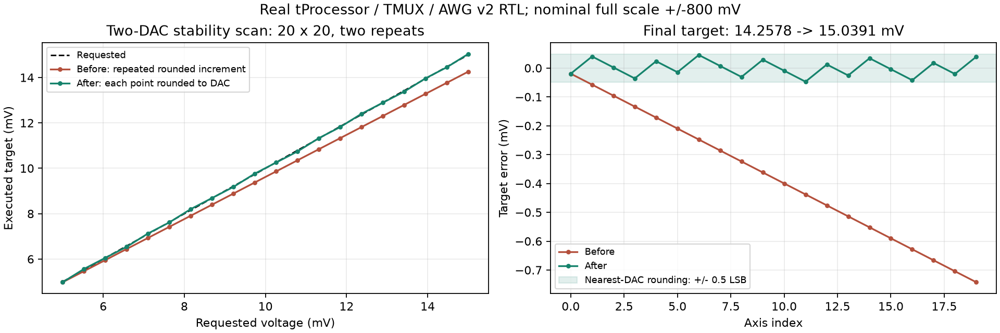
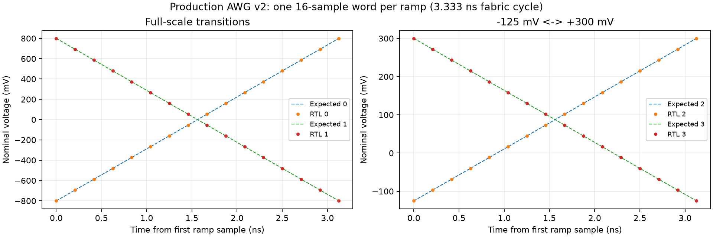

# AWG tuning v2 validation

Status: All listed RTL checks passed.

Actual production tProcessor, TMUX, command/output slices and two AWG v2 wrappers were simulated.
The raw oracle checks all 16 AWG lanes. Fast/stability/mixed RF cases also check the complete integer RC recurrence.
The SquarePulse coexistence case checks raw AWG data and all three outputs through an independent analog RC model.
RFDC and ARM are excluded. These are digital tests, not analog board measurements.

| Case | Points x repeats | Commands | Raw samples per DAC | Result |
| --- | --- | --- | --- | --- |
| Wide-step voltage, 20 x 20 | 400 x 2 | 8002 | 8,205,424 | Passed |
| Stability + DC/RC, 20 x 20 | 400 x 2 | 8002 | 17,695,920 | Passed |
| Ramp duration + voltage, 20 x 20 | 400 x 2 | 18402 | 20,890,192 | Passed |
| Hold duration + voltage, 20 x 20 | 400 x 2 | 18318 | 23,505,552 | Passed |
| RF duration + voltage, 20 x 20 | 400 x 2 | 18318 | 21,468,112 | Passed |
| RF frequency + power, 20 x 20 | 400 x 2 | 18402 | 19,836,432 | Passed |
| SquarePulse + AWG, 10 x 10 | 100 x 2 | 4602 | 5,025,520 | Passed |

## Voltage accuracy

20-point 5 to 15 mV scan: final executed target 15.03906250 mV; maximum target error 0.04728618 mV.
The old final target was 14.25781250 mV. One effective DAC LSB at nominal +/-800 mV is 0.09765625 mV.
Targets now match independent nearest-DAC rounding. RAMP steps use those rounded endpoints. DC compensation uses their area.
Independent 200 x 200 grids were also checked in software with unequal DAC scales.
The tProcessor instruction model executed all 40,000 points twice and matched every positive target to independently rounded voltages, including each inner-axis rewind.
This additional 80,000-shot instruction-model check is not a 200 x 200 Verilog simulation; the production RTL grids remain 20 x 20.
Voltage tables are read inside hardware loops, with no host operation per point. Independent axes use O(Nx + Ny) storage.
Coupled voltage/duration fields can require joint tables; insufficient tProcessor DMEM is reported before execution.
Large fixed-voltage DC duration grids retain factored fractional time coefficients when their rounding bound is below half a fabric clock.

## Analog RC residuals

Digital pass means the commands, timing, raw samples and integer RC recurrence agree. It is not a claim of zero analog error.
Mixed and SquarePulse analog fixtures use tau = 10 us and nominal full scale +/-800 mV. The stability grid uses tau = 300 us and checks the digital recurrence without the full-grid analog model.
The mixed sweeps record the maximum analog-model error without imposing the fixed-waveform 4.2-code bound.
The analog capacitor state persists when digital IIR history resets; DAC quantization and residual DC pulse area remain.

| Case | AWG 1 maximum error (mV) | AWG 2 maximum error (mV) |
| --- | ---: | ---: |
| Ramp duration + voltage, 20 x 20 | 0.079354 | 0.067939 |
| Hold duration + voltage, 20 x 20 | 0.077048 | 0.069655 |
| RF duration + voltage, 20 x 20 | 0.079720 | 0.064985 |
| RF frequency + power, 20 x 20 | 0.064111 | 0.060732 |
| SquarePulse + AWG, 10 x 10 | 0.076412 | 0.060636 |

## Verification limits

- Full-scale raw ramps: 170 cases / 117,200 samples; both full-scale directions fit one 16-sample word.
- Software regression: 210 checks in gui_regression.log plus the 80,000-shot check in large_grid_instruction_model.log; v1/v2 and shared front-panel state are covered.
- Python driver/model regression: 14 checks in qick_regression.log.
- Actual generated HWH routing and GUI AWG/Stability selection: hwh_gui_validation.json; screenshot gui_v2_front_panel.png.
- Full-grid fast/stability runs use exact integer RC checks; their full grids do not use the analog RC model.
- Mixed RF sweeps include the independent analog RC model. RF power uses synthetic calibration data, not measured dBm.
- 300 MHz is verified from Tcl/HWH, the 3.333 ns constraint, LMK04828_300.00.txt and ZCU216 clock setup; no live clock measurement was made.
- Firmware publication additionally requires routed timing closure and matching BIT/HWH extracted from one XSA.

## Firmware implementation

Published firmware: `C:/JeonghyunPark/Workspace/QSTL_QICK/qick/firmware/projects/qstl_awg_v2`.

Routed setup WNS: 0.006120 ns; hold WHS: 0.009412 ns.
Minimum bus-skew slack: 2.532 ns.
Setup, hold and pulse-width checks pass. No-clock and unconstrained internal endpoint counts are both zero.
The timing report lists 4 external inputs and 24 external outputs without I/O delay constraints; this result does not sign off their off-chip timing.
Reset/CDC and other methodology warnings remain in the saved reports; timing closure does not mean a warning-free design.
BIT and top-level HWH were extracted from the same XSA; hashes and selected members are recorded in build_manifest.json.

## Recovery integrity checks

Both Git object databases passed fsck; 38 source files passed readability/syntax checks.
135 completed design checkpoints passed ZIP CRC validation; XPR/HWH XML parsing passed.
XSA CRC, extracted BIT/HWH equality and published artifact hashes passed. See recovery_audit_final.json.
Readability, syntax, CRC and regression checks; no pre-crash hash exists for every uncommitted file.

