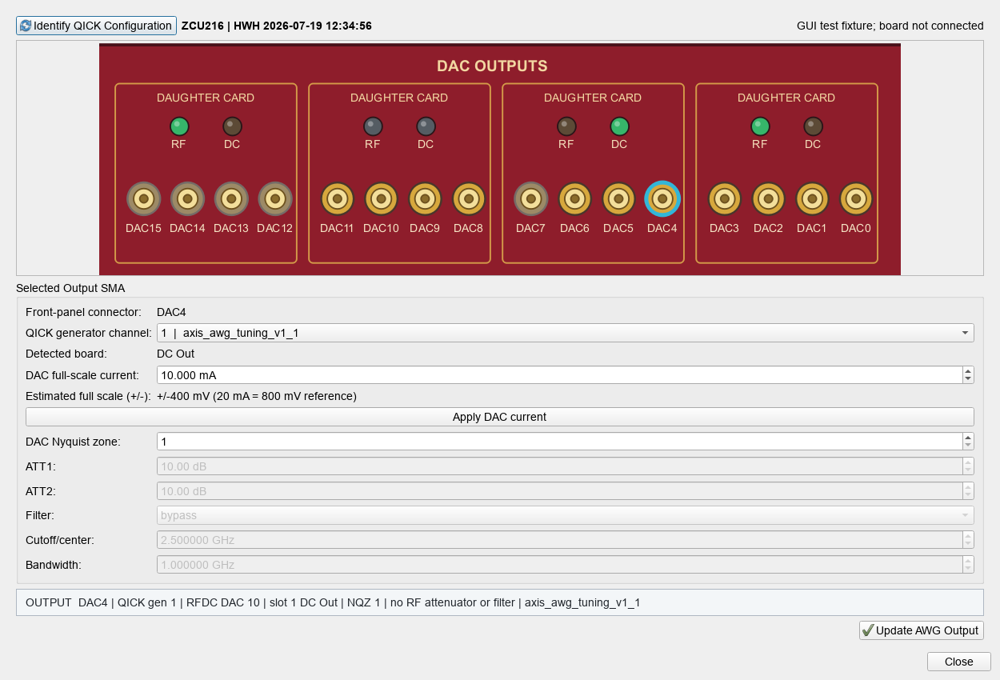
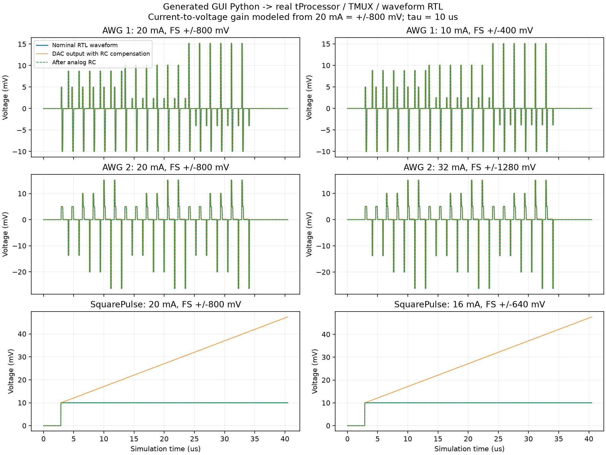
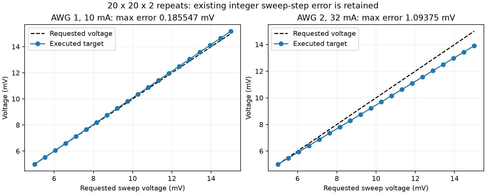

# DAC current RTL validation

Software scaling and command timing passed. Physical current/voltage were not measured.
RFDC analog current gain is modeled as 800 mV at 20 mA; ARM and RFDC are excluded from this RTL testbench.

| Case | Points x repeats | Currents: AWG1 / AWG2 / Square (mA) | Commands | Cycles |
|---|---:|---|---:|---:|
| baseline | 9 x 2 | [20.0, 20.0, 20.0] | 416 | 12187 |
| different_currents | 9 x 2 | [10.0, 32.0, 16.0] | 416 | 12187 |
| rf_and_duration | 9 x 2 | [32.0, 10.0, 20.0] | 416 | 34937 |
| grid_20x20 | 400 x 2 | [10.0, 32.0, 16.0] | 18402 | 425083 |
| fixed_voltage_dc | 9 x 2 | [10.0, 32.0, 16.0] | 416 | 12187 |

Every emitted command word and timestamp matched; both AWG RC integer recurrences were checked at every scalar sample.
Each repeat and sweep-axis reset was checked. The 20x20 case had 801 history resets per AWG.
Small cases also used an independent analog RC model. The full 20x20 grid checked digital arithmetic without the analog RC model.

## Analog RC residuals (small cases)

| Case | Channel | Maximum error (mV) |
|---|---|---:|
| baseline | 0 | 0.07765354 |
| baseline | 1 | 0.0573843506 |
| baseline | 2 | 0.0490436768 |
| different_currents | 0 | 0.050053772 |
| different_currents | 1 | 0.0890650391 |
| different_currents | 2 | 0.0391116406 |
| rf_and_duration | 0 | 0.129604453 |
| rf_and_duration | 1 | 0.0312542847 |
| rf_and_duration | 2 | 0 |
| fixed_voltage_dc | 0 | 0.048128833 |
| fixed_voltage_dc | 1 | 0.0905889062 |
| fixed_voltage_dc | 2 | 0.0391116406 |

## Voltage sweep precision

This change preserves the existing integer increment mechanism; it does not fix accumulated sweep-step rounding.
Requested 5 -> 15 mV, 20 points:
- AWG 1: final 15.1855469 mV; maximum target error 0.185546875 mV.
- AWG 2: final 13.90625 mV; maximum target error 1.09375 mV.

The nominal voltage-to-code quantization step is full_scale_mv / 8192 (four signed-16 codes).
Requested increment is 10/19 = 0.526315789 mV. The existing constant code increment rounds to 44 codes (0.537109375 mV) at 10 mA, and 12 codes (0.46875 mV) at 32 mA.
RF duration case checks 18 RF pulses while the two AWGs use different currents; RF gain/frequency and pulse timing are unchanged.

## Shared GUI and independent compensation checks

356 selected GUI/compiler regression tests passed; after the final port-selection fix, all 35 current/front-panel tests passed again.
The GUI click test opens AWG Tuning -> Stability -> AWG Tuning front panels, applies 10/32/16/12 mA through the real worker/server setter with an emulated RFDC, and checks every channel write. Untargeted DACs, RF outputs, AWG assignments and user-entered voltage/sweep values remain unchanged.
Fixed-voltage and fixed-time DC fields were independently checked against hold + trapezoidal ramp area in mV us for two channels, both current assignments and every 3x3 point. RC coefficient was checked against round(2^48 / (2*tau_us*4800)), independent of output current.
Live RFDC current and physical output voltage were not measured. Current control requires a compatible updated QICK server and enabled VOP hardware conditions.

