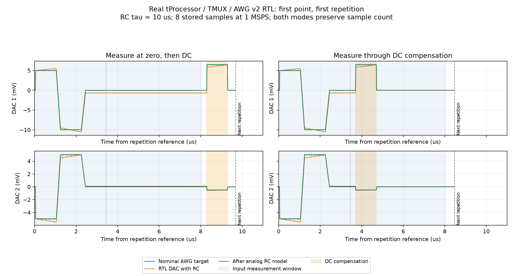
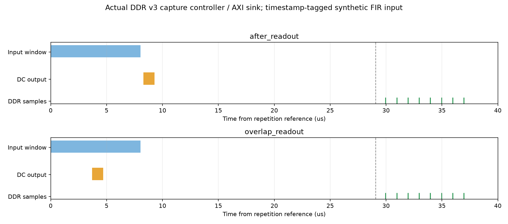

# FIR measurement / DC compensation order validation

GUI branch: `awg_tuning_v2`. Default: `after_readout`; optional: `overlap_readout`.
GUI commit: `64762e5424e44ddcbf33dc3cc76fe6b43072268e`.
No FPGA IP or bitstream change is required.

| Case | Policy | DC mode | Points x repeats | Command timing/value errors | DDR samples |
|---|---|---|---|---|---|
| hold_duration | after_readout | fixed_time | 9 x 2 | 0 / 0 | 144 |
| hold_duration | overlap_readout | fixed_time | 9 x 2 | 0 / 0 | 144 |
| two-DAC voltage | after_readout | fixed_voltage | 9 x 2 | 0 / 0 | 144 |
| two-DAC voltage | overlap_readout | fixed_voltage | 9 x 2 | 0 / 0 | 144 |
| ramp_rate | after_readout | fixed_voltage | 9 x 2 | 0 / 0 | 144 |
| ramp_rate | overlap_readout | fixed_voltage | 9 x 2 | 0 / 0 | 144 |
| rf_duration | after_readout | fixed_time | 9 x 2 | 0 / 0 | 144 |
| rf_duration | overlap_readout | fixed_time | 9 x 2 | 0 / 0 | 144 |

All 8 runs passed: 144 shots, 1152 DDR IQ samples. Two AWG channels each reset 19 times per run.
Real production tProcessor, TMUX, AWG v2, RC recurrence, RF DDS (mixed cases), GPIO, DDR v3 controller and AXI sink were simulated.
DDR input was synthetic timestamp-tagged data at 1 MSPS. This is not an ADC/RFDC/FIR numeric or physical-board measurement.
The configured 8712-clock delay matures exactly, then capture starts on the next valid 1 MSPS sample. Input windows and DDR storage windows are different.
Every point/repeat command was compared; every AWG scalar sample and RC integer recurrence was checked. RF durations matched all tested commands.
Initial harness diagnostics exposed a sample-edge assumption, a missing monitor insertion, and a frozen timestamp tag. Only corrected fir_dc4 matrix result.json files are counted.
Waveform files contain only the first 12000 clocks. Full-run event and sample-count checks remain active.
Software: 246 assertions passed. Two Qt test modules hit a native exception during process teardown; the previous GUI also reproduces it after settings reload. See [recovery notes](RECOVERY.md) and [exit codes](software_modules/exit_codes.json).
Recovery checks found no corrupted Git objects, changed RTL fingerprints, PMEM/DMEM mismatch, Python syntax errors, or damaged report JSON/PNG files.

