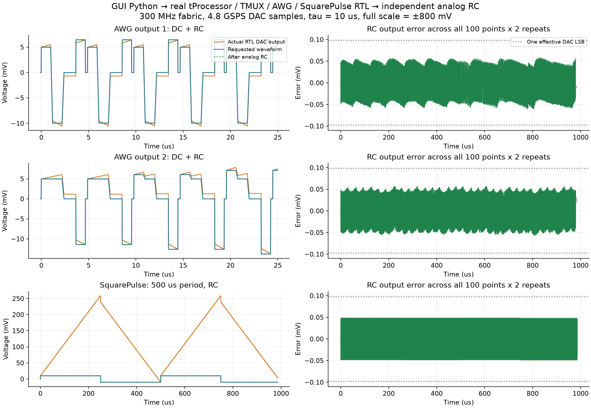
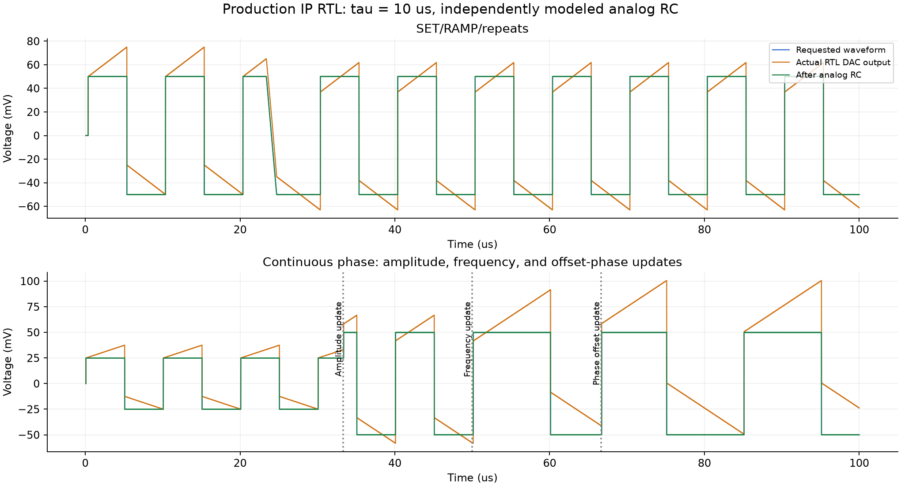
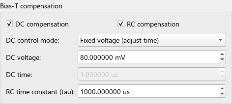
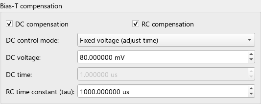

# RC precompensation validation

**Update:** AWG Tuning and Stability Diagram now reset AWG IIR history after
every repetition. See the [per-repeat reset validation](repeat_reset/REPORT.md)
and its before/after plot. The original continuous-history results below are
retained as the baseline, including the later [residual-area audit](residual_audit/REPORT.md).

The previous software flat-segment RC correction has been removed from the
QICK GUI. AWG Tuning and Stability Diagram now configure the same continuous
FPGA inverse high-pass. Their DC and RC checkboxes are independent; the
existing opposite-area DC pulse algorithm is retained. SquarePulse uses
software-calculated signed increments and linear accumulation.

Branches: `QSTL_QICK:codex/rc-precompensation` and
`PulseGenerator-qick:codex/rc-precompensation-gui`.

## Actual RTL and analog RC verification

All digital samples come from the production IP RTL in Vivado 2023.1 XSim.
The analog circuit is an independent first-order RC model with an exact
zero-order-hold state update. This is simulation, not a physical board
measurement. Analog component tolerance, extra poles and noise are not modeled.

The sample rate is 4.8 GSPS: 16 scalar samples per 300 MHz fabric clock.
The internal history is signed 72-bit with 48 fractional bits. The fractional
precision belongs to the compensation arithmetic; the DAC output remains
signed integer data with 14 effective bits (four int16 codes per DAC LSB).

Five simultaneous AWG/SquarePulse pairs matched an independent scalar integer
oracle for **4,796,640 output comparisons**. The test also checks the internal
72-bit history every fabric word, including increments below one DAC LSB at
tau = 1000 ms. SET, RAMP, repeated waveforms and SquarePulse amplitude,
frequency and phase-offset updates were exercised.

| Tau | AWG maximum error (int16 codes) | Square maximum error (int16 codes) |
|---|---:|---:|
| 10 us | 2.030402 | 2.017823 |
| 100 us | 2.006429 | 2.004668 |
| 1 ms | 2.003760 | 2.006199 |
| 100 ms | 0.102397 | 0.207179 |
| 1000 ms | 0.010240 | 0.020721 |

These error measurements cover the test's 100 us window. The tau = 1000 ms
case verifies fractional accumulation and coefficient precision; it is not a
claim of a one-second analog settling test.

At tau = 1000 ms the rounded reciprocal coefficient is 29320, corresponding
to -10.5754 ppm relative coefficient error. At 100 ms it is 293203, or
-0.3436 ppm. These are coefficient errors, distinct from DAC quantization.

Separate actual-IP tests pass for positive DAC clipping, signed history rails,
explicit history reset, mute with nonzero history, and exact bypass latency.
No tested overflow wraps polarity. The original Square DDS core and AXI wrapper
regressions also pass, including random updates, stalls and CDC mute.

## GUI program executed by the real tProcessor RTL

The GUI exports Python, which compiles to instruction and data memory loaded
through the AXI test host. The simulation retains the production tProcessor,
TMUX blocks, register slices, two AWG IPs, SquarePulse and trigger output.
ARM and RFDC are outside this simulation boundary.

Each case contains 100 hardware sweep points and two repetitions. DC and RC
are enabled together; tau is 10 us. SquarePulse has a requested 500 us period
and continues after the main program ends. The 32-bit frequency-word rounding
gives 499.879806 us at this DAC clock.

| Case | Command/trigger events checked | PMEM words | DMEM words | Maximum RC output error |
|---|---:|---:|---:|---:|
| 10 x 10 AWG voltage axes | 4202 | 202 | 0 | 2.541878 codes |
| 10 AWG voltages x 10 Square amplitudes | 4202 | 200 | 20 | 2.738324 codes |

Every command's packed value and timestamp matches the expected hardware-loop
execution after a single measured simulation-start offset. The second case
checks that Square amplitude and its matching RC increment update atomically.
Each case checks approximately 4.75 million scalar samples per output against
the independent RC model.

At an illustrative full scale of +/-800 mV, the overall maximum is
**0.066854 mV**, less than one effective DAC LSB (0.097656 mV).
Voltage conversion uses that configured full scale; it is not measured DAC
calibration. The raw code errors above are independent of this choice.
The reference is the nominal digital waveform from the uncompensated IP,
so these errors isolate RC precompensation. Initial voltage-to-code rounding
and the existing AWG ramp/sweep quantization are separate from this error.

The [Square amplitude sweep waveform/error plot](square_amplitude_sweep/gui_rc_verification.png)
shows the second integration case, including continuous compensation across
the amplitude changes.

## Python and GUI

- 217 GUI/compiler/storage/regression tests pass. One pre-existing
  pyqtgraph/NumPy deprecation warning remains.
- 23 QICK driver/assembler tests pass.
- All four DC/RC checkbox combinations, saved settings, generated Python,
  Stability Diagram, Square amplitude tables, old firmware behavior and
  output/readout timing anchors are covered.
- Legacy firmware retains its original timing and ordinary/DC behavior;
  enabled RC is rejected before output starts.

The RC path and bypass both add 11 fabric clocks (36.667 ns). Square commands
have 15 clocks of IP latency including their original four-clock pipeline.
The GUI timing model includes these delays. The waveform preview represents
the requested voltage after the RC circuit, not the larger compensated DAC
voltage.

## Limits and firmware artifacts

Tau is supported from 10 us through 1000 ms. A nonzero mean still integrates
until the finite DAC range is exhausted. Saturation and sticky clipping status
make this observable. DC compensation closes nominal pulse area using the
existing algorithm. RC history persists across repetitions and sweeps;
explicit reset starts a new assumed capacitor history.

Full-project Vivado 2023.1 synthesis, placement and routing pass with the
existing 300 MHz constraints. Routed setup WNS is **+0.041301 ns**, hold WHS is
**+0.009500 ns**, and TNS/THS are zero. Pulse-width failing endpoints, missing
clocks and unconstrained internal endpoints are all zero. All 14 bus-skew
constraints pass. Unrouted, partially routed and overlapping nets are zero.
The minimum bus-skew slack is +2.705 ns, and the separately reported
SquarePulse setup slack is +0.256 ns.

| Whole-design resource | Previous build | RC build | Device utilization |
|---|---:|---:|---:|
| LUTs | 178653 | 241289 | 56.74% |
| Registers | 292897 | 336104 | 39.52% |
| DSPs | 2352 | 2576 | 60.30% |

Each AWG RC instance uses 32 DSPs; the SquarePulse RC instance uses zero DSPs.
The 1000 ms precision fits without reducing the requested tau range. The
existing timing constraints were not relaxed. Methodology warning categories
and counts match the previous build (82 warnings), and DRC has no errors.
Previous reports are preserved in `evidence/pre_rc_baseline`.

BIT/XSA generation and publication completed successfully. The following BIT
and top-level HWH were extracted from the same timing-closed XSA:

- [BIT](../../qick/firmware/projects/qstl_awg_tuning_fir_1msps_iq64_sq_pulse/bitstream.bit)
- [HWH](../../qick/firmware/projects/qstl_awg_tuning_fir_1msps_iq64_sq_pulse/bitstream.hwh)
- [XSA](../../qick/firmware/projects/qstl_awg_tuning_fir_1msps_iq64_sq_pulse/bitstream.xsa)
- [Build manifest and SHA-256 hashes](../../qick/firmware/projects/qstl_awg_tuning_fir_1msps_iq64_sq_pulse/build_manifest.json)
- [Independent XSA member/hash verification](firmware_verification.json)
- [Completed full-build log](evidence/full_build.log)
- [Full timing/resource reports](../../qick/firmware/projects/qstl_awg_tuning_fir_1msps_iq64_sq_pulse/validation_reports/timing_summary_postroute.rpt)

The HWH confirms RC capability on all seven AWG tuning outputs and the sole
SquarePulse output. The 1 MSPS IQ64 FIR/DDR path remains unchanged, including
its 8712-cycle capture correction. The publisher checks source/build RTL byte
identity, timing, bus skew and HWH configuration before updating any artifact.
