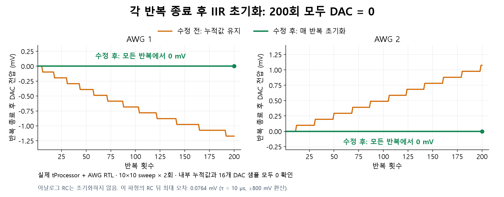

# AWG IIR reset after every repetition

The common AWG Tuning/Stability Diagram compiler now ends each nominal AWG
waveform at zero, completes any DC compensation, then sends the existing
firmware's RC `reset=True` command on every participating AWG. Reset remains
enabled across repetition and sweep boundaries, including the final shot.
The coefficient and RC enable stay active. The existing recovery interval
starts after reset and pipeline flushing; no tau-dependent wait was added.

The final acquisition count is deferred until the last reset has completed,
including configurations without SquarePulse or external trigger markers.
RC-disabled and legacy-firmware timing retain their existing behavior.
The continuous SquarePulse generator keeps its existing phase/history behavior.
No production RTL or firmware binaries were changed for this update.

## Real RTL result

The GUI export was compiled into PMEM/DMEM and executed by the actual
tProcessor/TMUX/AWG RTL for a 10 x 10 sweep with two repetitions per point.

- 4,602 command/marker events matched their exact expected values/timestamps.
- Each AWG received 201 resets: startup plus all 200 repetitions.
- All 201 checks per AWG found the 72-bit history and every one of the 16
  DAC sample lanes equal to zero after reset pipeline completion.
- Approximately 5 million scalar samples per channel were checked against
  the independent analog RC model; maximum AWG error was 3.130727 int16 codes
  (0.076434 mV at the illustrative +/-800 mV full scale).
- The two-AWG example adds 79 fabric/tProcessor clocks (0.263333 us at
  300 MHz) per repetition to enqueue and flush the reset commands.
- PMEM is 222 words and no runtime table words are needed in this example.

The AWG-only case (no SquarePulse and no external marker) also passed the
same 200-shot actual-RTL run: 3,602 command events matched, with 201 exact
history/all-lane-zero checks per AWG. Its PMEM is 206 words and maximum analog
RC error is 3.178693 codes (approximately 0.07760 mV). See the
[AWG-only result](awg_only/result.json) and [log](awg_only/xsim.log).

Python/GUI regression checks passed 150 tests. After adding final-completion
handling for AWG-only runs, all 13 focused RC tests passed again. Coverage
includes full/boundary compilation, fixed-time/fixed-voltage/no DC compensation,
amplitude and duration sweeps, shared TMUX routing, and zero recovery time.

| Final DAC value | Before | After |
|---|---:|---:|
| AWG 1 | -1.171875 mV | 0 mV |
| AWG 2 | +1.07421875 mV | 0 mV |

Digital reset does not discharge the physical capacitor. Analog reset
transients remain possible; the small error above applies to this tested
waveform and tau, not arbitrary signals. This change removes inter-shot
digital history; it does not solve the separate actual-DAC-area balancing
or compensation-pulse quantization issues.

Evidence: [result](result.json), [XSim log](xsim.log),
[generated Python](gui_export.py), [assembly](program.asm).
