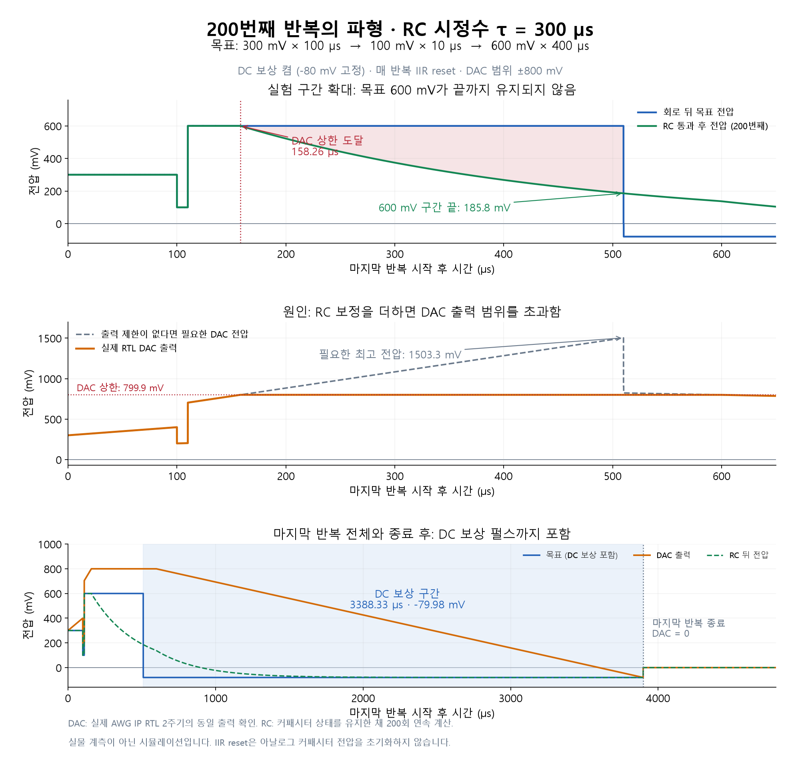

# Three-level pulse, tau = 300 us, 200 repetitions

## Conditions

- Desired post-RC waveform: +300 mV for 100 us, +100 mV for 10 us,
  then +600 mV for 400 us. Transitions are SET steps, with no extra ramps.
- Digital and analog RC tau: 300 us. Earlier small-signal plots used 10 us.
- Full scale assumption: +/-800 mV, 4.8 GSPS scalar DAC rate, 300 MHz fabric.
  The positive effective DAC rail is +799.90234375 mV.
- DC compensation enabled. The earlier 1 us fixed-time test setting cannot
  cancel this waveform within the output range. This case uses the GUI default
  fixed-voltage compensation magnitude of 80 mV instead.
- Quantized DC target is -79.98046875 mV for 3388.3266667 us. The nominal
  uncompensated positive area is 271000 mV us.
- AWG IIR is cleared after each completed compensation pulse, including the
  final repetition. Existing recovery is 20 tProcessor cycles. The complete
  repetition period is 3898.7 us. The analog capacitor state is never reset.

## Verification method

The current shared GUI Python compiler generated a 200-repeat hardware-loop
program (94 PMEM words). Its tProcessor instruction model produced the
cycle-timed command words. Those words were replayed for two complete periods
in the actual production `axis_awg_tuning_v1` RTL with its original DSP core
and RC output filter. The full tProcessor/RFDC/ARM were not simulated here.

37,434,544 scalar samples matched an independent integer recurrence oracle,
including the 72-bit integral history. Initial reset plus both repetition
resets were checked at zero. DAC clipping was observed. The two emitted DAC
periods were compared sample-for-sample and were exactly identical.

Because the digital state resets and the DAC period repeats exactly, the
actual RTL DAC period was propagated through the independent analog RC for
200 periods, retaining its capacitor state. The RC update is the exact
zero-order-hold solution for each constant DAC interval, not a coarse
time-step approximation. The affine period recurrence is
`z_next = exp(-period/tau) * z + b`. RTL itself ran two periods, not 200.

## Results

| Quantity | Result |
|---|---:|
| Required DAC peak without output clipping | 1503.3333 mV |
| First DAC rail sample | 158.260 us after shot start |
| Last positive-rail interval ends | 598.2908 us |
| Post-RC voltage at the end of the requested 600 mV segment | 185.7773 mV |
| Actual DAC after final reset | 0 mV |
| Post-RC voltage after final period | +0.0034972 mV |
| Largest first-versus-200th output difference | 0.0034972 mV |

The long DC compensation interval allows the clipping-induced analog state
error to decay almost completely before the next repetition. Therefore
accumulation over repetitions is small in this case, but the severe clipping
distortion during the 600 mV segment occurs on every repetition. Digital IIR
reset cannot recover a waveform requiring DAC voltage beyond its configured
range. Analog output tolerance, extra poles and noise are not included.

Evidence: [results](result.json), [RTL log](xsim.log),
[Python program](program.py), [compiled assembly](program.asm),
[production-IP testbench](tb_three_level.sv), [RTL waveform changes](waveform_rle.csv).
