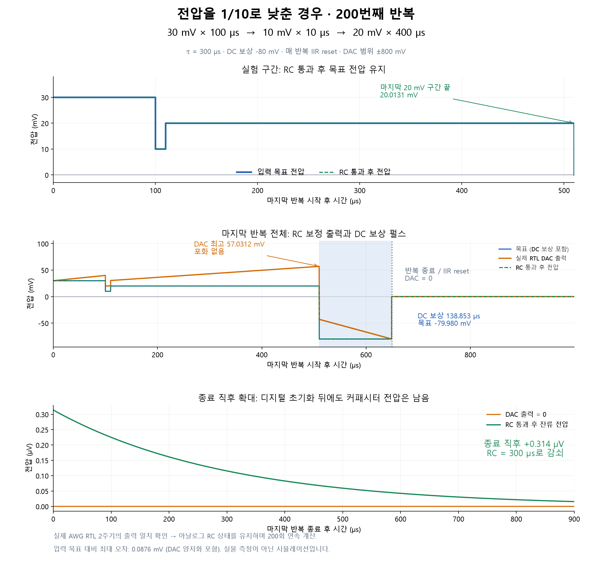

# Reduced-voltage waveform and GUI headroom validation

## Conditions

The preceding case changed the final 400 us level from 600 to 200 mV.
The subsequent request to divide all three levels by ten was applied to
that case: **30 mV / 100 us, 10 mV / 10 us, 20 mV / 400 us**.
The DC compensation setting remains -80 mV (fixed voltage); its duration
adapts to the waveform area. RC tau is **300 us**, DAC full scale is +/-800 mV,
fabric is 300 MHz, scalar DAC samples are 4.8 GSPS. The digital IIR is reset
after DC compensation on every repetition, including the last.

## Evidence and method

`run_case.py` compiles the GUI library's sequence for 200 repetitions.
The strict tProcessor behavior model supplies timed command words. The actual
production `axis_awg_tuning_v1` RTL executes two complete periods in Vivado
xsim; all 16 lanes and the signed 72-bit accumulator are checked against an
independent integer recurrence. This is not a full-tProcessor RTL run.

`xsim.log`: **PASS samples=6239600 resets=3 zero_checks=3 first_clip_cycle=-1**.
The two output periods are asserted bit-identical in `plot_case.py`.
The independent analog high-pass model then propagates that exact periodic
DAC trace for 200 repeats, retaining capacitor voltage between periods.
Each constant-output interval uses the exact exponential RC state update.
The analog capacitor is never reset. This does not claim 200 periods of RTL
simulation or a physical board measurement.

## Results

| Quantity | Result |
|---|---:|
| DAC maximum | +57.031250 mV |
| DAC minimum, including DC pulse | -79.980469 mV |
| Clipping | None |
| RC output at end of final 20 mV segment | +20.013073 mV |
| Maximum error vs user input levels, including quantization | 0.087586 mV |
| Maximum error vs quantized pre-RC target | 0.049187 mV |
| DC compensation duration | 138.853333 us |
| Full repetition duration | 649.226667 us |
| DAC after final reset | 0 mV |
| Analog RC output immediately after final repetition | +0.314001 uV |

The residual decays with tau = 300 us. The error maxima evaluate the first
and last scalar sample of every constant-DAC interval, including DC and idle
intervals, rather than a subsampled plotting grid. The ideal unconstrained
peak is 20 + (30*100 + 10*10 + 20*400)/300 = **57 mV**.

`result.json`, `last_repeat.npz`, `waveform_rle.csv`, `program.py`,
`program.asm`, `tb_three_level.sv`, and simulator logs accompany the figure.

## GUI implementation

Changes are in `C:/JeonghyunPark/Workspace/PulseGenerator-qick`, branch
`codex/rc-precompensation-gui`; the QCS checkout is untouched.

`DCWaveformGeneratorGUI/qick_rc_validation.py` adds a shared preflight used
by AWG Tuning, Stability Diagram, exported Python, and the program compiler.
It checks the actual DAC-side precompensated voltage, including physical
cross-capacitance conversion, SET/RAMP, DC pulses, and zero-input history
holds. Analytical extrema include interior points of a ramp. The compiler
rechecks the rounded hardware sweep endpoint commands and actual DC fields,
with conservative quantization/timing margins. Errors identify the output,
corner, predicted bounds and allowed range and prevent acquisition.

The voltage check evaluates only Cartesian endpoints: **four points for a
200 x 200 sweep**. Existing duration-table compiler validation is unchanged.
These bounds concern the reset-per-repeat AWG path; the continuous SquarePulse
history is a separate path and is not covered by this new AWG check.

Validation covers positive/negative overflow, a safe low-level waveform,
RAMP interior extrema, fixed-time/fixed-voltage DC, four-corner-only work,
hardware endpoint rounding crossing the rail, GUI/export/Stability wiring,
and legacy firmware with RC disabled. The existing stability test previously
used a clipping condition (predicted -1376 mV at tau=25 us); it now explicitly
checks rejection and verifies the valid configuration at tau=250 us.

Regression evidence: the five selected test modules produced 179 passes and
that one now-invalid stability expectation. After updating the expectation,
the affected test plus all 12 new range tests passed (13/13). Thus all 180
selected tests are verified, with logs in `regression_initial.txt` and
`regression_final.txt`.

No firmware change or bitstream rebuild is needed for this host-side guard.
