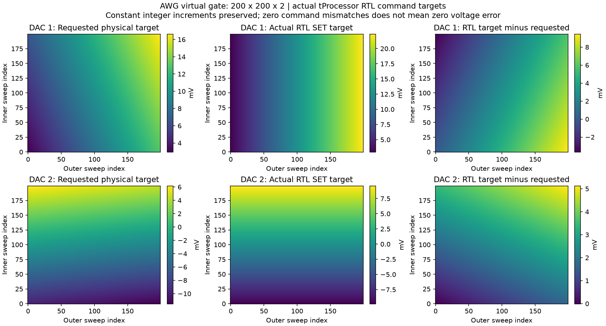
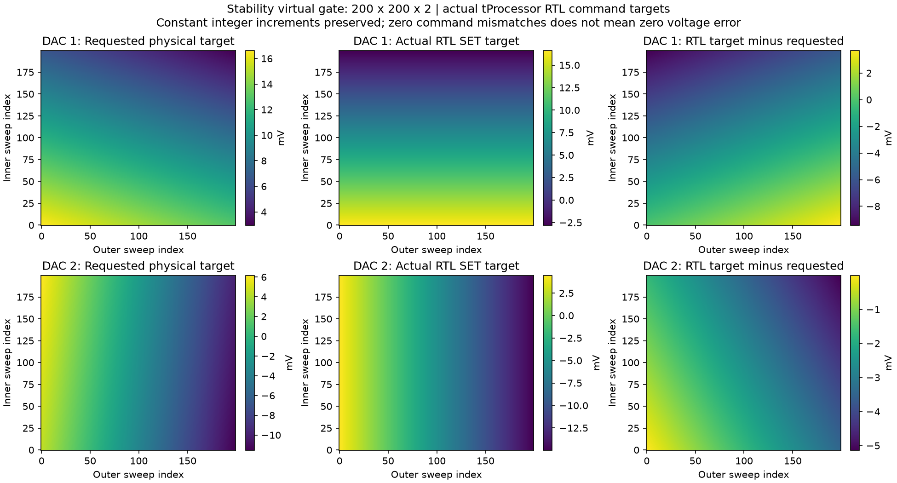
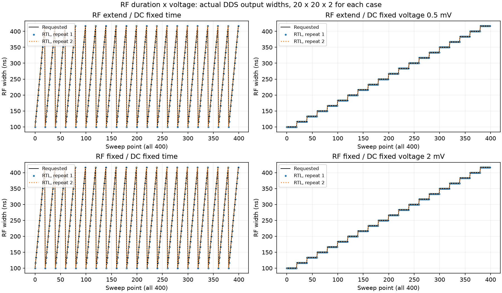
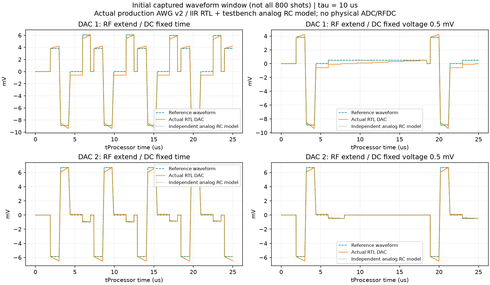

# TODO 최종 검증 보고서

2026-10-04. 아래 지원 조건의 실제 RTL 6종과 소프트웨어 413개 검사를 완료했다.
기존 정수 증분의 전압/면적 오차 및 DC 최소 SET 간격을 없앴다는 뜻은 아니다.

| 실제 RTL 조건 | 지점 × 반복 | 비교 명령 수 | 값 / 시각 불일치 | 각 DAC reset | PMEM / sweep DMEM words |
|---|---:|---:|---:|---:|---:|
| AWG virtual gate | 40000 × 2 | 1,439,202 | 0 / 0 | 80,001 | 211 / 0 |
| Stability virtual gate | 40000 × 2 | 800,002 | 0 / 0 | 80,001 | 135 / 0 |
| RF extend / DC fixed time | 400 × 2 | 18,366 | 0 / 0 | 801 | 335 / 140 |
| RF extend / DC fixed voltage 0.5 mV | 400 × 2 | 18,398 | 0 / 0 | 801 | 339 / 140 |
| RF fixed / DC fixed time | 400 × 2 | 18,322 | 0 / 0 | 801 | 227 / 20 |
| RF fixed / DC fixed voltage 2 mV | 400 × 2 | 18,402 | 0 / 0 | 801 | 255 / 20 |

## 바뀐 동작

- 200×200 virtual gate: 40,000행 Cartesian 전압표를 제거하고 기존 축별 정수 증분/add/rewind를 유지했다. AWG Tuning 및 Stability 모두 sweep DMEM 0 word이며 두 출력·반복·축 초기화를 실제 RTL로 확인했다.
- RF duration × voltage: RF segment fixed/extend와 DC fixed_time/fixed_voltage 네 조합을 실제 RTL 20×20×2로 확인했다. RF 출력 각 800개, 폭 오차 0 clock이다. 200×200의 방향/축 순서/DC 모드 조합은 소프트웨어 검사이며 전체 RF 200×200 RTL 검증은 아니다.
- 실행할 SET/DC 코드가 DAC 범위를 벗어나면 RC 옵션과 무관하게 사전 오류를 낸다.
- Qt 설정 복원 후 종료 오류: 창 deferred deletion과 QApplication 수명을 정리했고, 실제 main/event loop 및 0/1/5회 설정 복원 subprocess 종료도 확인했다.
- FIR 측정과 DC compensation 순서 선택은 기존 8종 RTL 및 이번 회귀 검사로 확인했다. ADC/FIR 아날로그 경로를 새로 측정한 것은 아니다.

## 남는 한계 — 정확히 구분할 것

- 32-bit Q18은 RAMP step이다. SET DAC 코드 간격과 정수 sweep 누적 오차는 바뀌지 않는다. 점별 정확 반올림표 또는 새로운 fractional voltage accumulator는 추가하지 않았다.
- ±800 mV에서 5→15 mV sweep의 끝값: 20점은 14.2578125 mV, 200점은 24.4140625 mV. 약 1 mV 오차는 20점 예시와 가깝고 200점에서 일반적으로 보장되는 값이 아니다.
- 실제 grid SET target의 최대 요청 오차: AWG 9.43328125/5.12031250 mV, 역방향·축반전 Stability 9.44203125/5.14023438 mV.
- 고정시간 DC 보상 전압도 정수 증분 오차가 남아 면적 완전 상쇄를 보장하지 않는다. 수치와 가정은 VOLTAGE_ERROR.md 참조.
- 원래 DC fixed_voltage 20 mV 두 RTL은 1~2클록 보상이 3클록으로 늘어나 실패했다(62/80개 명령 시각 불일치). 현재는 이 조건을 사전 거부한다. 지원 가능한 별도 재검증은 extend=0.5 mV, fixed=2 mV였다. 원래 20 mV 파형을 정확히 출력하도록 바꾼 것이 아니다.
- 이번 RTL은 실제 tProcessor/TMUX/AWG v2/IIR/RF DDS로 실행했다. 전체 clock의 raw AWG 및 RC 정수 연산을 검사했으며 큰 grid에는 아날로그 RC 모델을 적용하지 않았다. 아날로그 그림은 RF 사례의 초기 저장 구간이다.
- 큰 파형은 첫 12,000 clock만 저장했다. 원래 실패 로그도 보존했다. 추가 FPGA IP 및 bitstream 변경은 없고 commit/push하지 않았다.

## 면적 누적 IP 검토: 실제 LTspice 12조건

단일 pole AC coupling 뒤의 목표 파형과 반복 종료 상태 복구에는 IIR 앞의 면적을 합산하고 보상도 IIR 앞에 넣는 것이 맞았다. IIR 뒤의 DAC ramp/offset 면적을 다시 보상하는 조건은 다르다.
tau=300 us, 고정전압 시험의 마지막 보상 종료 뒤 잔류는 앞/앞 +0.000019 mV, 뒤/앞 +86.397 mV, 뒤/뒤 +19.956 mV였다. 이는 이상 inverse/PWL source와 실제 LTspice R/C 회로 비교다. 새 FPGA 면적 IP의 RTL 또는 실제 보드 정확도 검증이 아니다. IP는 구현하지 않았다.

## 그림과 상세 결과

- [RTL 상세](RTL_REPORT.md)
- [전압 및 DC 면적 오차](VOLTAGE_ERROR.md)
- [원래 짧은 DC 보상 실패](SHORT_DC_FINDING.md)
- [LTspice 회로·수치·파형](LTSPICE_REPORT.md)
- [최종 소프트웨어 exit codes](software_final/exit_codes.json)
