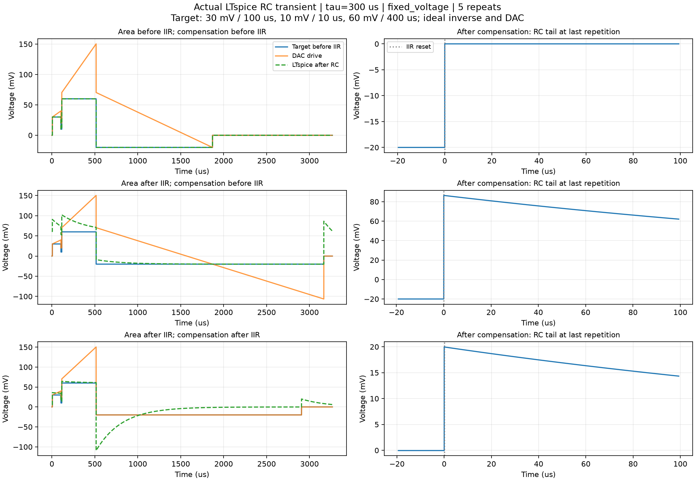
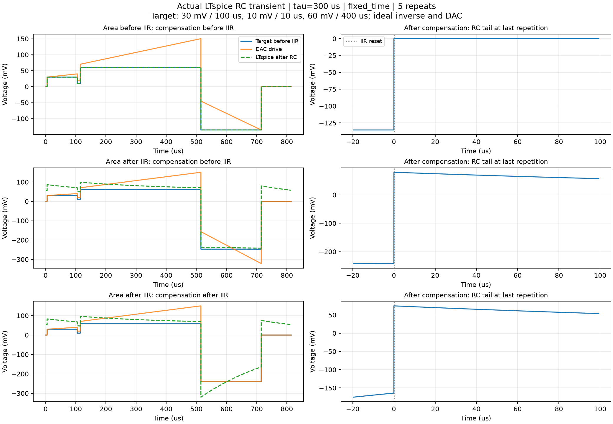

# IIR 전후 면적 수집 위치 비교

2026-10-04. **추가 FPGA IP를 구현한 결과가 아니라, 실제 LTspice를 실행한 회로 검토 결과**다.

## 결론

현재 목적이 AC coupling 뒤에서 목표 파형을 재현하고, 반복 끝에 IIR 상태와 아날로그 커패시터 상태를 함께 0으로 되돌리는 것이라면 **IIR 앞의 파형 면적을 합산하고, DC 보상 펄스도 IIR 앞에 삽입**해야 한다. RC 보정 때문에 DAC에 더해지는 ramp 및 flat offset의 면적을 이 합계에 다시 넣지 않는다.

DAC 자체의 시간 평균 전압을 0으로 만드는 것은 별개의 조건이다. IIR 뒤 DAC 면적을 0으로 맞추더라도 커패시터가 초기 상태로 돌아오는 것은 아니다. 다음 반복 직전에 디지털 IIR만 0으로 초기화하면 남은 커패시터 전압이 출력 오차로 나타난다.

## 회로와 실행 조건

- LTspice: `C:/Program Files/ADI/LTspice/LTspice.exe`, `-b -ascii` batch 실행. 실제 회로 소자는 직렬 C와 출력-접지 사이 1 kΩ R이다.
- τ=300 µs에서는 C=300 nF, τ=1 ms에서는 C=1 µF이다. 물리적 커패시터를 반복마다 초기화하지 않았다.
- 사용자 파형: 30 mV × 100 µs → 10 mV × 10 µs → 60 mV × 400 µs. 5회 반복했다.
- 고정 전압 보상은 −20 mV, 고정 시간 보상은 200 µs이다. 보상 종료 후 21 ns에 디지털 IIR 상태를 초기화한다.
- 각 비교 회로의 반복 주기는 동일하고, 가장 긴 보상 구간 뒤에도 100 µs 대기 시간이 있도록 정했다.
- PWL source가 목표 파형과 이상적인 연속시간 역필터 출력을 제공한다. LTspice가 실제 R/C 과도응답을 계산한다. **Verilog IIR, DAC 양자화, 실제 케이블·증폭기·다중 pole 또는 saturation을 이 회로 시험으로 검증했다는 의미는 아니다.**
- 코드: `qick/firmware/ip/rc_precomp_validation/ltspice_area_domains.py`. `.cir`, `.pwl`, `.log`, `.raw`, 수치 JSON과 그림은 `ltspice/`에 있다.

## 비교한 세 방식

| 방식 | 면적을 모으는 신호 | 보상 펄스를 넣는 위치 |
|---|---|---|
| A | IIR 입력 x | IIR 입력 |
| B | IIR 출력 u | IIR 입력 |
| C | IIR 출력 u | IIR 출력, 필터를 우회 |

B는 보상하는 동안에도 변하는 **실제 DAC 면적**까지 고려해 종료 시 ∫u=0이 되도록 계산했다. 보상 전 면적만 얼려 사용하는 불리한 구현을 가정한 것이 아니다. C도 DAC 면적이 0이 되도록 보상 시간/전압을 계산했다.

## 실제 LTspice 결과

아래 값은 5번째 반복의 보상 종료 0.1 µs 후 RC 출력이다. IIR 초기화 뒤의 잔류값이며, 값이 작을수록 다음 반복으로 남는 오차가 작다.

| τ | 보상 모드 | A: 앞에서 수집/앞에 삽입 | B: 뒤에서 수집/앞에 삽입 | C: 뒤에서 수집/뒤에 삽입 |
|---|---|---:|---:|---:|
| 300 µs | 고정 전압 −20 mV | +0.000019 mV | +86.397 mV | +19.956 mV |
| 300 µs | 고정 시간 200 µs | +0.000006 mV | +79.667 mV | +74.929 mV |
| 1 ms | 고정 전압 −20 mV | +0.000002 mV | +18.269 mV | +11.793 mV |
| 1 ms | 고정 시간 200 µs | +0.000001 mV | +14.318 mV | +14.130 mV |

A의 전체 반복 중 사용자 파형 구간 최대 오차는 τ=300 µs에서 0.000102 mV 미만, τ=1 ms에서 0.000031 mV 미만이었다. 이는 이 이상 회로/소스의 수치 오차 수준이며 실제 보드 정확도 보장이 아니다.

τ=300 µs 고정 전압 모드에서 A의 보상 시간은 1,355 µs, B는 2,651.269 µs, C는 2,391.75 µs였다. 고정 시간 모드의 보상 전압은 각각 −135.5 mV, −247.13125 mV, −239.175 mV였다.





## 왜 IIR 앞이 맞는가

이상적인 1차 high-pass의 역필터는 다음과 같다.

```
u(t) = x(t) + integral(x(t) dt) / tau
```

물리 회로의 커패시터 전압을 z, RC 뒤 출력을 y라고 하면 `y = u - z`, `dz/dt = y/tau`이다. 초기 상태가 일치하면 `y=x`, `z=integral(x)/tau`이므로 반복 종료 때 `integral(x)=0`으로 만들면 커패시터와 역필터 적분 상태가 함께 0이 된다.

반면 `integral(u)=0`은 위의 `z=0` 조건이 아니다. 따라서 DAC ramp/offset 면적까지 다시 DC 보상하면 원래 목표 파형에 필요한 보상보다 더 큰 보상이 될 수 있다. 그림 B는 면적을 더 빼다가 디지털 적분 상태가 음수가 된 뒤 reset하면서 큰 양의 출력이 생기는 예다.

이는 [공식 high-pass precompensation 계수](https://docs.zhinst.com/hdawg_user_manual/functional_description/specific/pre_compensation.html)의 연속시간 한계와 일치한다. 이 표의 IIR은 일반적인 모든 AC 회로가 아니라 **지정한 τ의 단일 pole 모델**을 역보상한다.

## 면적 누적 IP를 나중에 설계한다면

입력은 AWG가 실제 생성한 **IIR 이전 샘플**이어야 한다. 명령의 이상적인 전압×시간만 합산하는 대신 실제 ramp 끝점, sample 수, clipping 전 값과 DC 보상 샘플까지 포함한다. 현재 역필터의 trapezoidal 적분과 일치하게 `x[n]+x[n-1]`의 합 및 경계 샘플을 취급해야 한다.

- 고정 전압: 반대 부호 보상 샘플을 출력하며 잔여 면적을 줄인다. 끝에서 한 샘플 미만의 면적 잔여와 판단/출력 pipeline 지연을 따로 처리해야 한다.
- 고정 시간: 필요한 평균 보상 전압은 `−면적/시간`이다. 나눗셈을 없애려면 소프트웨어가 시간의 역수를 계수로 넘기거나, 고정 전압 단계와 마지막 잔여량을 배분하는 별도 제어가 필요하다. 면적을 누적하기만 해서 이 계산이 없어지는 것은 아니다.
- 16 samples/clock 병렬 누적과 넓은 누산기가 필요하지만, 현재 검토에서는 RTL 구조·비트 폭·합성 가능성을 새로 확정하지 않았다.
- IIR 이후 DAC saturation이 발생하면 역필터의 전제가 깨진다. 이 경우 앞에서 면적을 맞추는 것만으로 실제 출력 오차를 제거할 수 없으므로 기존 출력 범위 검사가 계속 필요하다.

**이 IP는 이번 작업에서 구현하지 않았다.** 200×200 DMEM 오류는 소프트웨어의 joint table 생성 때문에 생겼으므로, 그 오류를 없애기 위해 추가 FPGA IP가 필요한 것은 아니다. SET 전압 증분 오차와 DC 보상 면적 오차도 서로 다른 문제다.
