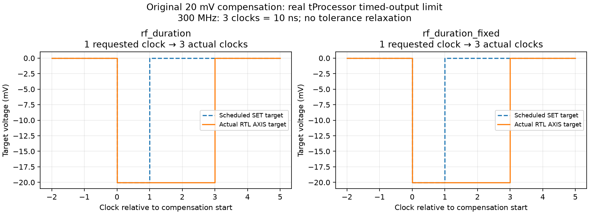

# DC 보상 최소 SET 간격: 추가 RTL 실패와 수정

원래 고정전압 20 mV 조건의 두 RF duration × voltage RTL 실행은 **실패**다.
RF 출력 길이 오류로 분류하지 않는다. 일부 sweep 지점의 보상 면적이 거의 0이어서
DC 보상의 시작 SET와 종료 SET가 1~2 tProcessor clock 간격으로 예약됐지만,
실제 tProcessor 출력은 3 clock 간격이었다. 명령 값 자체는 모두 일치했다.

| 원래 실행 | 타이밍 불일치 | +1 clock | +2 clocks |
|---|---:|---:|---:|
| RF extend / DC fixed_voltage 20 mV | 62 | 28 | 34 |
| RF fixed / DC fixed_voltage 20 mV | 80 | 40 | 40 |

`axis_tproc64x32_x8_v1/src/timed_ictrl.vhd`의 SET → READ → WAIT → SET 상태 전이로
같은 출력 포트의 연속 SET 간격은 최소 3 clock이다. 현재 300 MHz에서는 10 ns다.
AWG v2의 RAMP step 32-bit 확장이나 입력 duration 레지스터로 이 간격이 바뀌지는 않는다.
RC IIR 출력 파이프라인은 두 에지를 함께 지연시키므로 이 폭 차이를 없애지 않는다.

## 소프트웨어 수정

`_validate_bias_t_set_spacing()`가 1~2 clock으로 반올림되는 비영 DC 보상을 실행 전에 거부한다.
고정시간 모드도 같은 간격을 검사한다. 오류 메시지에는 출력 이름, sweep 지점, 요구 clock,
최소 간격을 표시하고 더 낮은 고정전압 또는 더 긴 고정시간 설정을 안내한다.
전압·시간을 몰래 바꾸거나 비교 허용오차를 늘리지 않았다. 0 clock으로 반올림되어 생략되는
기존 sub-cycle 정책은 그대로이며, 그 양자화 오차가 사라졌다는 뜻은 아니다.

경계값만 파형 컴파일하는 정책은 유지한다. 경계만으로는 찾을 수 없는 내부의 면적 0 교차는
기존 축별 정수 증분/계수 행에 정수 구간식을 적용해 검사한다. 점별 전압 표를 만들지 않는다.

원래 두 실패 폴더와 이 보고서를 보존한다. 지원 가능한 별도 RTL 조건은 extend=0.5 mV,
fixed=2 mV의 고정 보상 전압으로 20×20×2씩 실행한다. 사용자의 실험 설정을 변경한 것이 아니다.
새 실행의 `result.json`이 없으면 성공이라고 보고하지 않는다. 기존 fixed_time 2종과
200×200 AWG/Stability 실행의 입력·PMEM은 이 실행 전 검사 추가로 바뀌지 않는다.

추가 하드웨어/bitstream은 변경하지 않았다. 1~2 clock의 연속 고정전압 보상 자체를 지원하려면
현 방식 밖의 별도 출력 정책 또는 IP 변경이 필요하다. 실행 전 차단을 해당 파형의 구현 완료로
표현하지 않는다.
