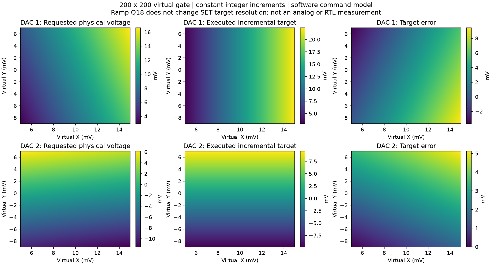

# 32-bit RAMP 증분과 200×200 SET 전압 오차

AWG v2의 확장은 RAMP `step`의 signed 24-bit Q16 → signed 32-bit Q18이다. **SET target 전압이 32-bit 정밀도로 확장된 것은 아니다.** DAC 전달값은 16-bit 코드이며 하위 2-bit는 유효하지 않으므로 ±800 mV 설정에서는 유효 한 칸이 0.09765625 mV이다. ±400 mV에서는 0.048828125 mV이다.

기존 hardware sweep은 시작 코드와 끝 코드를 구한 뒤, 한 번 반올림한 일정 증분을 매 지점 더한다. 안쪽 축이 끝나면 같은 증분의 누적량을 빼고 시작값으로 되돌린다. 200×200은 한 축의 오차가 40,000번 계속 누적되는 구조가 아니다. 각 축에서 최대 199번 더한 오차가 발생한다.

```
start_code = quantize(start_voltage)
end_code   = quantize(end_voltage)
delta_code = round_to_DAC_quantum((end_code - start_code) / (N - 1))
code[i]    = start_code + i * delta_code
```

## “약 1 mV 밀림”의 구분

±800 mV, 요청 5→15 mV의 경우:

| 지점 수 | 시작 코드 | 지점당 증분 | 마지막 실제 목표 전압 | 마지막 오차 |
|---:|---:|---:|---:|---:|
| 20 | 204 | 20 code | 14.2578125 mV | −0.7421875 mV |
| 200 | 204 | 4 code | 24.4140625 mV | +9.4140625 mV |

따라서 기억한 약 1 mV는 이전 20점 예시와 비슷하지만, 200점에서도 항상 그 정도라고 할 수는 없다. RAMP Q18의 정밀도를 높여도 이 SET 전압 증분 오차는 줄어들지 않는다.

## TODO의 virtual gate 조건

행렬 `[[1, 0.23], [-0.17, 1]]`, X=5→15 mV, Y=−9→7 mV, 각각 200점, DAC full-scale ±800/±400 mV이다.

| 항목 | DAC 1 | DAC 2 |
|---|---:|---:|
| 시작 코드 | 120 | −808 |
| X축 증분 code | 4 | 0 |
| Y축 증분 code | 0 | 8 |
| 마지막 요청 물리 전압 | 16.61 mV | 4.45 mV |
| 마지막 실행 목표 전압 | 22.36328125 mV | 9.5703125 mV |
| 전체 grid 최대 목표 전압 오차 | 9.43328125 mV | 5.1203125 mV |

작은 결합 성분은 고정 정수 증분으로 표현되지 않아 0이 된다. **프로그램이 200×200에서 컴파일되고 RTL에서 명령을 정확히 실행하는 것과, 이상적인 virtual gate 전압을 정확히 재현하는 것은 다르다.** 이번 변경은 사용자가 요청한 기존 증분 방식의 실행·메모리 회귀를 해결하며 이 양자화 한계는 보존한다.



## DC compensation의 별도 오차

기존 고정 시간 모드는 보상 전압도 정수 증분으로 업데이트하므로 오차가 쌓일 수 있다. 위 grid에서 gate 1 µs + 0.1 µs 선형 return, 보상 2 µs로 계산하면 보상 target의 최대 차이는 DAC 1에서 9.27734375 mV, DAC 2에서 0.48828125 mV이다. 여기서 비교 기준은 **실제로 실행될 target 코드의 이상적인 선형 파형 면적**으로부터 지점별 최적 보상 코드를 구한 값이다.

계획 면적의 최대 잔여는 각각 18.5107421875, 0.966796875 mV·µs이다. 이 값은 실제 RTL/아날로그 R/C 면적 측정값이 아니라 명령 수준의 면적 계산이며, ramp의 sample 양자화·pipeline을 포함한 정확한 적분값과 구분한다.

고정 전압 모드는 보상 **시간**을 기존 fractional register로 유지하므로 같은 조건의 계획 면적 잔여는 양쪽 모두 최대 약 0.050456 mV·µs였다. 보상 전압이 다르거나 pulse가 길어지면 이 값도 달라진다. 고정 시간 모드가 모든 grid에서 면적을 정확히 상쇄한다고 주장하지 않는다.

**추가 RTL 발견 후 해석:** 위 20 mV 고정전압 수치는 최소 SET 간격 검사 도입 전의 이상적인 예약 명령 면적이다. 일부 내부 지점은 1~2클록 보상을 요구하여 현재 소프트웨어가 실행 전에 거부한다. 실제로 그 짧은 보상을 출력한 RTL 면적 오차라고 읽으면 안 된다. [3클록 제한과 원래 실패 기록](SHORT_DC_FINDING.md)을 함께 확인해야 한다. 최종 소프트웨어 검사의 지원 가능 고정전압 grid는 0.1 mV를 사용하며, 원래 20 mV grid의 거부 검사도 별도로 통과했다.

## 추가 FPGA IP가 필요한가

- **DMEM 부족 해결:** 필요 없다. 40,000행 Cartesian 전압표를 제거하고 축별 증분과 duration에 따른 계수 행으로 표현할 수 있다. 이번 수정이 이 방법이다.
- **전압 누적 오차 개선:** 추가 FPGA IP가 필수는 아니다. tProcessor에서 일정한 고정소수점 증분과 잔여값을 보존하는 방법이 가능하다. 점별 전압표를 저장하는 방법과 다르지만, 기존의 정수 증분 방식과도 다르므로 이번 요청에서는 적용하지 않았다.
- **실제 출력 면적의 보상:** raw AWG 샘플을 누적하는 IP는 실제 ramp sample과 보상 잔여를 직접 다룰 수 있다. 하지만 이미 잘못 양자화된 virtual-gate target 자체를 올바른 전압으로 되돌리는 기능은 아니다.
- **수집 위치:** 단일 RC 역보상의 목적에는 IIR 앞 샘플을 합산하고 보상도 IIR 앞에 삽입하는 것이 맞다. [실제 LTspice 비교 보고서](LTSPICE_REPORT.md)에 회로, 계산식, 12개 조건의 결과와 파형을 정리했다.

추가 면적 누적 IP 및 새로운 고정소수점 voltage sweep 구현은 이번 작업에 포함하지 않았다.
