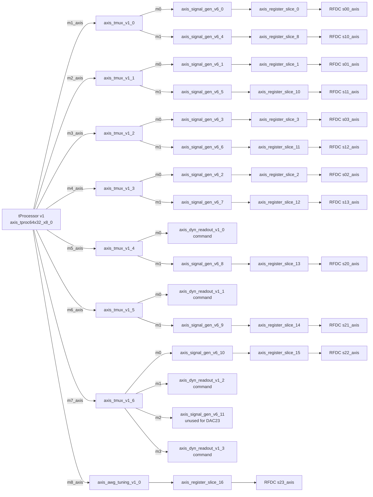

# qstl_awg_tuning

`qstl_awg_tuning` is an isolated Vivado block-design variant copied from
`qick/firmware/projects/qstl` for bringing up `axis_awg_tuning_v1` without
changing the original `qstl` project.

The variant reserves DAC23 / RFDC `s23_axis` for the AWG tuning path:

- `axis_tproc64x32_x8_0/m8_axis -> axis_awg_tuning_v1_0/s_axis`
- `axis_awg_tuning_v1_0/m_axis -> axis_register_slice_16/s_axis`
- `axis_register_slice_16/m_axis -> usp_rf_data_converter_0/s23_axis`

`axis_awg_tuning_v1_0` is explicitly configured in `bd_2023-1.tcl` with:

| Parameter | Value |
| --- | ---: |
| `CONFIG.N_DDS` | 16 |
| `CONFIG.B` | 16 |
| `CONFIG.FRAC` | 16 |
| `CONFIG.CMD_WIDTH` | 160 |

The AWG IP uses the same DAC realtime domain as the DAC generator paths:

| AWG pin | BD net source |
| --- | --- |
| `aclk` | `usp_rf_data_converter_0_clk_dac2`, sourced from `dac_clk_buf/BUFG_O` |
| `aresetn` | `rst_dac2_peripheral_aresetn`, sourced from `rst_dac0/peripheral_aresetn` |



## tProcessor realtime outputs

| tProcessor output | Destination in this BD | Notes |
| --- | --- | --- |
| `m0_axis` | `axi_dma_tproc/S_AXIS_S2MM` | tProcessor data readback path |
| `m1_axis` | `axis_tmux_v1_0/s_axis` | Commands gen0 and gen4 |
| `m2_axis` | `axis_tmux_v1_1/s_axis` | Commands gen1 and gen5 |
| `m3_axis` | `axis_tmux_v1_2/s_axis` | Commands gen3 and gen6 |
| `m4_axis` | `axis_tmux_v1_3/s_axis` | Commands gen2 and gen7 |
| `m5_axis` | `axis_tmux_v1_4/s_axis` | Commands readout0 and gen8 |
| `m6_axis` | `axis_tmux_v1_5/s_axis` | Commands readout1 and gen9 |
| `m7_axis` | `axis_tmux_v1_6/s_axis` | Legacy commands for gen10, readout2, gen11, readout3 |
| `m8_axis` | `axis_awg_tuning_v1_0/s_axis` | AWG tuning command path |

`axis_tproc64x32_x8_0` exposes 160-bit realtime output words on `m1_axis`
through `m8_axis`. In this variant, `m8_axis` is dedicated to AWG tuning
commands and matches `axis_awg_tuning_v1_0` `CMD_WIDTH = 160`.

## DAC output mapping

| RFDC input | DAC path source | Register slice |
| --- | --- | --- |
| `s00_axis` | `axis_signal_gen_v6_0/m_axis` | `axis_register_slice_0` |
| `s01_axis` | `axis_signal_gen_v6_1/m_axis` | `axis_register_slice_1` |
| `s02_axis` | `axis_signal_gen_v6_2/m_axis` | `axis_register_slice_2` |
| `s03_axis` | `axis_signal_gen_v6_3/m_axis` | `axis_register_slice_3` |
| `s10_axis` | `axis_signal_gen_v6_4/m_axis` | `axis_register_slice_8` |
| `s11_axis` | `axis_signal_gen_v6_5/m_axis` | `axis_register_slice_10` |
| `s12_axis` | `axis_signal_gen_v6_6/m_axis` | `axis_register_slice_11` |
| `s13_axis` | `axis_signal_gen_v6_7/m_axis` | `axis_register_slice_12` |
| `s20_axis` | `axis_signal_gen_v6_8/m_axis` | `axis_register_slice_13` |
| `s21_axis` | `axis_signal_gen_v6_9/m_axis` | `axis_register_slice_14` |
| `s22_axis` | `axis_signal_gen_v6_10/m_axis` | `axis_register_slice_15` |
| `s23_axis` | `axis_awg_tuning_v1_0/m_axis` | `axis_register_slice_16` |

## ADC/readout mapping

| RFDC output | Readout IP input | Readout command input |
| --- | --- | --- |
| `m20_axis` | `axis_dyn_readout_v1_0/s1_axis` | `axis_tmux_v1_4/m0_axis -> s0_axis` |
| `m21_axis` | `axis_dyn_readout_v1_1/s1_axis` | `axis_tmux_v1_5/m0_axis -> s0_axis` |
| `m22_axis` | `axis_dyn_readout_v1_2/s1_axis` | `axis_tmux_v1_6/m1_axis -> s0_axis` |
| `m23_axis` | `axis_dyn_readout_v1_3/s1_axis` | `axis_tmux_v1_6/m3_axis -> s0_axis` |

## Legacy gen11 status

`axis_signal_gen_v6_11` is intentionally kept instantiated to minimize BD
churn around the existing generator DMA, AXI-Lite, tProcessor tmux, clock, and
reset plumbing. It still has:

- waveform DMA input from `axis_switch_gen/M11_AXIS` to `s0_axis`
- command input from `axis_tproc64x32_x8_0/m7_axis` through
  `axis_tmux_v1_6/m2_axis` and `axis_register_slice_27`
- AXI-Lite mapping at `0xA0160000`

However, `axis_signal_gen_v6_11/m_axis` is not connected to
`axis_register_slice_16/s_axis` in this variant. DAC23 is driven only by
`axis_awg_tuning_v1_0`.

Summary rules for this variant:

- DAC23 is AWG tuning output.
- tProcessor `m8_axis` is reserved for AWG tuning commands.
- Do not use the old gen11 path unless the BD is changed.
- The old `m8_axis -> axis_set_reg_0 -> qick_vec2bit_0` trigger path is
  removed; `qick_vec2bit_0/din` is tied low with `xlconstant_5`.

## Vivado invocation note

To avoid leaving Vivado-generated files in the repository, run project creation
from an external working directory and set `::origin_dir_loc` to the repository
root before sourcing `proj.tcl`:

```tcl
set repo_root {C:/path/to/QSTL_QICK}
set ::origin_dir_loc $repo_root
source "$repo_root/qick/firmware/projects/qstl_awg_tuning/proj.tcl"
validate_bd_design
report_ip_status
```

This variant is intended for Vivado wiring validation and firmware bring-up.
It intentionally does not add Python driver or assembler support.
