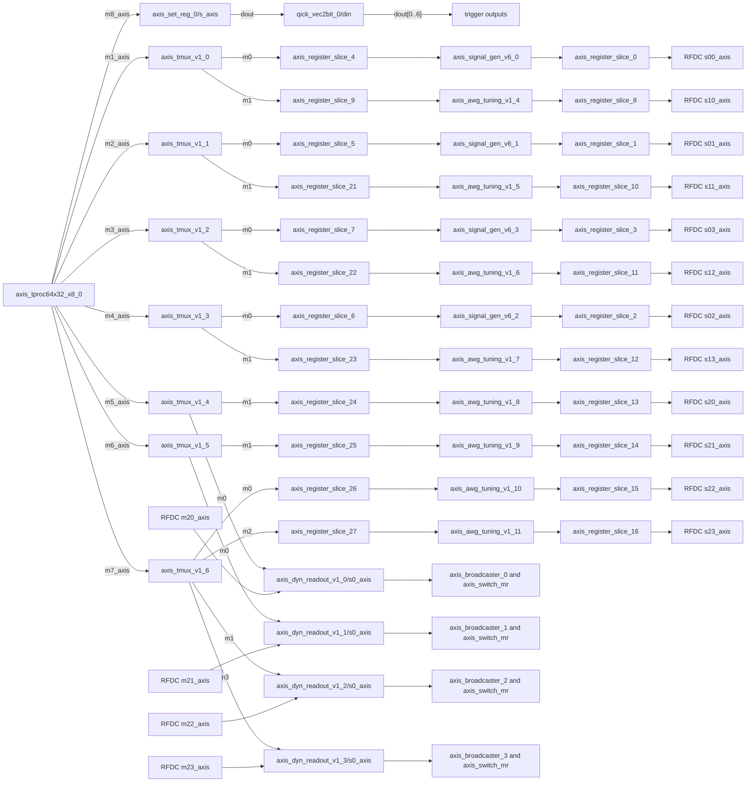

# qstl_awg_tuning

This project variant is recreated from `qick/firmware/projects/qstl`.
The original `qstl` project is not modified.

Only the `axis_signal_gen_v6` instances whose original property block
explicitly contained `CONFIG.GEN_DDS {FALSE}` are replaced:

- Replaced: `axis_signal_gen_v6_4` through `axis_signal_gen_v6_11`
- Replacement IP: `axis_awg_tuning_v1_4` through `axis_awg_tuning_v1_11`
- Parameters: `N_DDS=16`, `B=16`, `FRAC=16`, `CMD_WIDTH=160`

The DDS-enabled generators remain unchanged:

- Preserved: `axis_signal_gen_v6_0` through `axis_signal_gen_v6_3`

Preserved blocks and paths:

- `axis_tproc64x32_x8_0/m8_axis` still drives `axis_set_reg_0/s_axis`
- `axis_set_reg_0/dout` still drives `qick_vec2bit_0/din`
- `qick_vec2bit_0/dout[0..6]` remains the trigger fanout
- `axis_set_reg_0` and `qick_vec2bit_0` are unchanged
- readout IPs, readout tmux paths, avg buffers, `mr_buffer`, DDR4, RFDC, DMA, PS, clock/reset, and interrupt blocks are not replaced
- RFDC DAC slice assignments remain the same

Removed only for the replaced DDS-disabled generators:

- waveform-load `s0_axis` connections
- AXI-Lite `s_axi` connections
- `s0_axis_*` and `s_axi_*` clock/reset pins
- stale address assignments

The Vivado project script computes the repository root from this script
location and creates the batch project under the parent workspace:

```text
C:\JeonghyunPark\Workspace\Vivado_Output\qstl_awg_tuning
```

## Routing


