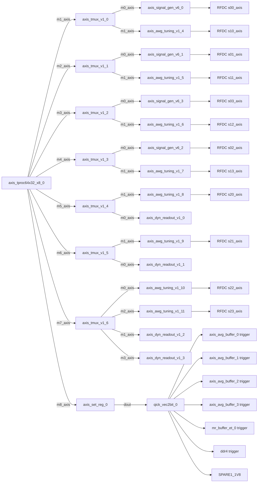

# qstl_awg_tuning_fir

This variant is copied from qstl_awg_tuning.
Only axis_signal_gen_v6 instances with GEN_DDS FALSE are replaced by axis_awg_tuning_v1.
m8_axis remains the original trigger/control path.
Readout paths are unchanged.
DDS-enabled signal generators are unchanged.
RFDC DAC endpoint assignments are preserved.

The DDR capture hierarchy replaces the original Xilinx AXIS width converter
with QICK:QICK:axis_triggered_pack_32to256_v1:1.0. The custom packer drops
pre-trigger samples, starts a fresh 8-sample pack on each trigger rising edge,
packs eight 32-bit readout samples into one 256-bit AXIS beat, and discards
partial packs when trigger falls. The existing axis_clock_converter_0,
axis_buffer_ddr_v1_0, AXI SmartConnect, and DDR4 controller are unchanged.

## Replacements

| Original | New | Command source preserved | RFDC DAC endpoint preserved |
| --- | --- | --- | --- |
| axis_signal_gen_v6_4 | axis_awg_tuning_v1_4 | axis_tmux_v1_0/m1_axis -> axis_register_slice_9 | usp_rf_data_converter_0/s10_axis |
| axis_signal_gen_v6_5 | axis_awg_tuning_v1_5 | axis_tmux_v1_1/m1_axis -> axis_register_slice_21 | usp_rf_data_converter_0/s11_axis |
| axis_signal_gen_v6_6 | axis_awg_tuning_v1_6 | axis_tmux_v1_2/m1_axis -> axis_register_slice_22 | usp_rf_data_converter_0/s12_axis |
| axis_signal_gen_v6_7 | axis_awg_tuning_v1_7 | axis_tmux_v1_3/m1_axis -> axis_register_slice_23 | usp_rf_data_converter_0/s13_axis |
| axis_signal_gen_v6_8 | axis_awg_tuning_v1_8 | axis_tmux_v1_4/m1_axis -> axis_register_slice_24 | usp_rf_data_converter_0/s20_axis |
| axis_signal_gen_v6_9 | axis_awg_tuning_v1_9 | axis_tmux_v1_5/m1_axis -> axis_register_slice_25 | usp_rf_data_converter_0/s21_axis |
| axis_signal_gen_v6_10 | axis_awg_tuning_v1_10 | axis_tmux_v1_6/m0_axis -> axis_register_slice_26 | usp_rf_data_converter_0/s22_axis |
| axis_signal_gen_v6_11 | axis_awg_tuning_v1_11 | axis_tmux_v1_6/m2_axis -> axis_register_slice_27 | usp_rf_data_converter_0/s23_axis |

## Routing

