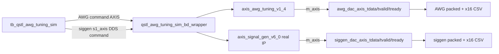

# qstl_awg_tuning_sim

Authors: Jeonghyun Park (jeonghyun.park@ubc.ca or alexist@snu.ac.kr), Farbod

Simulation-only Vivado 2023.1 project for observing the RFDC-bound AWG tuning
stream without modifying the production `qstl_awg_tuning` project.

The generated Vivado project is kept outside this repository:

```text
C:/JeonghyunPark/Workspace/Vivado_Output/qstl_awg_tuning_sim
```

## Production paths mirrored for review

The production block design routes these two RFDC-bound streams:

- Signal generator: `axis_tproc64x32_x8_0/m1_axis -> axis_tmux_v1_0/s_axis -> axis_tmux_v1_0/m0_axis -> axis_register_slice_4/S_AXIS -> axis_signal_gen_v6_0/s1_axis -> axis_signal_gen_v6_0/m_axis -> axis_register_slice_0/s_axis -> usp_rf_data_converter_0/s00_axis`
- AWG tuning: `axis_tproc64x32_x8_0/m1_axis -> axis_tmux_v1_0/s_axis -> axis_tmux_v1_0/m1_axis -> axis_register_slice_9/S_AXIS -> axis_awg_tuning_v1_4/s_axis -> axis_awg_tuning_v1_4/m_axis -> axis_register_slice_8/s_axis -> usp_rf_data_converter_0/s10_axis`

The user's `maxis1` request maps to the actual production port
`axis_tproc64x32_x8_0/m1_axis`.

The production AWG IP instance uses `N_PTS=16`, matching the 256-bit RFDC
stream width (`16 lanes x 16 bits`). This project uses the same `N_PTS=16`.

## What this project does

- Creates a separate Vivado project under `C:/JeonghyunPark/Workspace/Vivado_Output/qstl_awg_tuning_sim`.
- Keeps generated Vivado project files, logs, simulation work directories, and CSV outputs outside the repository.
- Instantiates the generated simulation BD wrapper from `qstl_awg_tuning_sim_bd`.
- Instantiates the packaged `axis_awg_tuning_v1` IP as `axis_awg_tuning_v1_4`.
- Instantiates the packaged `axis_signal_gen_v6` IP as `axis_signal_gen_v6_0`
  with `N=10`, `N_DDS=16`, `GEN_DDS=TRUE`, `ENVELOPE_TYPE=COMPLEX`.
- Drives the AWG command sequence: `SET 1000`, `RAMP 2000/64`, `SET -500`, `RAMP -1500/64`, `SET 0`.
- Drives the signal-generator `s1_axis` command source in DDS-only mode
  (`outsel=1`) at 25 MHz. With `aclk=100 MHz` and `N_DDS=16`, the effective
  sample rate is 1600 MS/s and the DDS frequency word is `0x04000000`.
- Captures packed 256-bit AXIS data and testbench-only x16 lane serialization CSVs.
- Replaces the tProcessor with a simple testbench AXIS command source.
- Replaces the RFDC with named external BD ports:
  `siggen_dac_axis_*` and `awg_dac_axis_*`.
- Ties off the AWG AXI-Lite interface, signal-generator AXI-Lite interface, and
  signal-generator `s0_axis` waveform-load inputs because this simulation is
  focused on the AXIS command paths.

## Pruned simulation routing



## Signal generator stimulus

This project uses the real `axis_signal_gen_v6` IP and stimulates its `s1_axis`
command interface. The command selects DDS-only output (`outsel=1`), so the
AXI-Lite memory-load registers and `s0_axis` waveform input are tied off. The
simulation validates that the real signal-generator output becomes valid and
non-X, and captures it in packed and x16 CSVs.

The AWG and signal-generator commands are not equivalent program commands, so
the comparison CSV is a numeric observation diff only. It is not an equality
pass/fail criterion.

## Run

From a Vivado 2023.1 batch shell:

```tcl
vivado -mode batch -source C:/JeonghyunPark/Workspace/QSTL_QICK/qick/firmware/projects/qstl_awg_tuning_sim/sim/run_sim.tcl
```

Expected CSV outputs in the XSim run directory:

- `qstl_awg_tuning_sim_awg_packed.csv`
- `qstl_awg_tuning_sim_awg_x16.csv`
- `qstl_awg_tuning_sim_siggen_packed.csv`
- `qstl_awg_tuning_sim_siggen_x16.csv`
- `qstl_awg_tuning_sim_compare.csv`
- `qstl_awg_tuning_sim_events.csv`
- `qstl_awg_tuning_sim_x16_plot.png`
- `qstl_awg_tuning_sim_latency_plot.png`

Lane order for x16 CSVs is `sample[i] = tdata[16*i +: 16]`, so lane 0 is
`tdata[15:0]` and lane 15 is `tdata[255:240]`.

To regenerate plots from the XSim CSV directory:

```text
python C:/JeonghyunPark/Workspace/QSTL_QICK/qick/firmware/projects/qstl_awg_tuning_sim/sim/plot_results.py C:/JeonghyunPark/Workspace/Vivado_Output/qstl_awg_tuning_sim/qstl_awg_tuning_sim.sim/sim_1/behav/xsim
```
