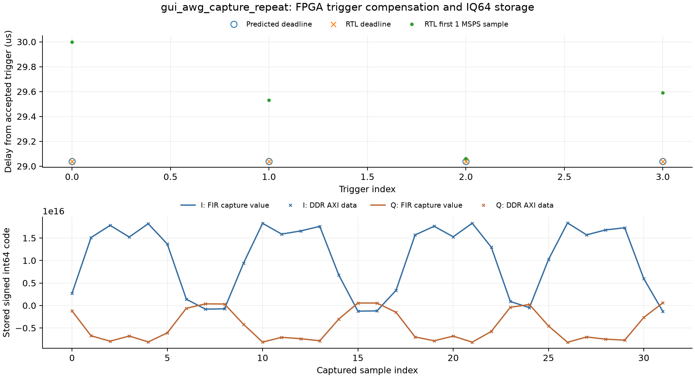
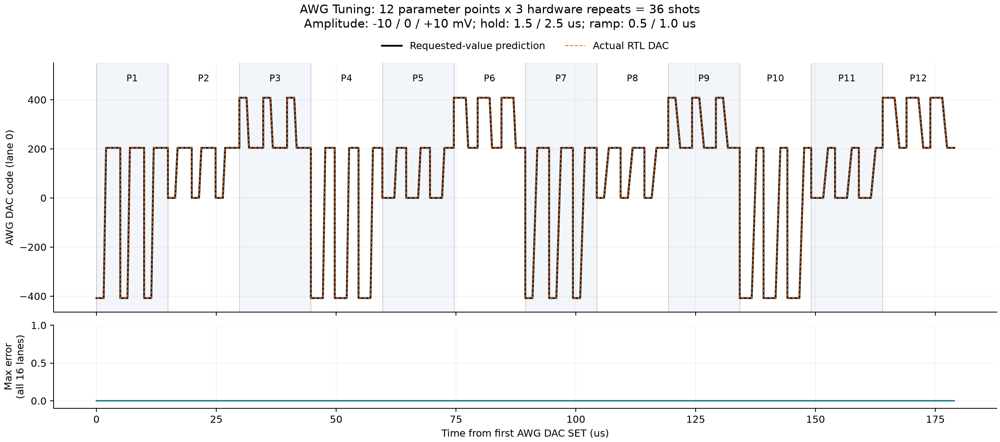
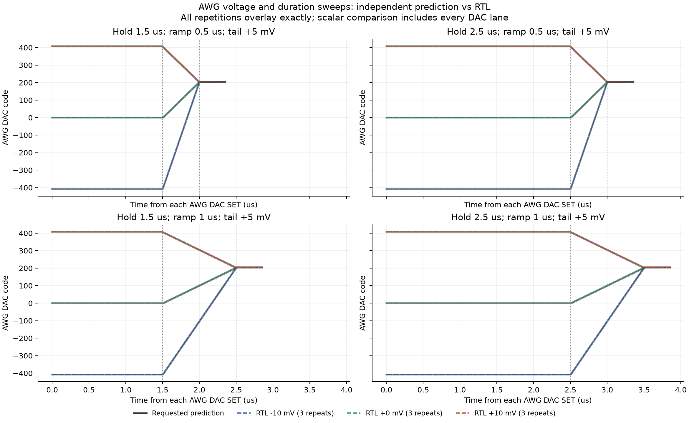
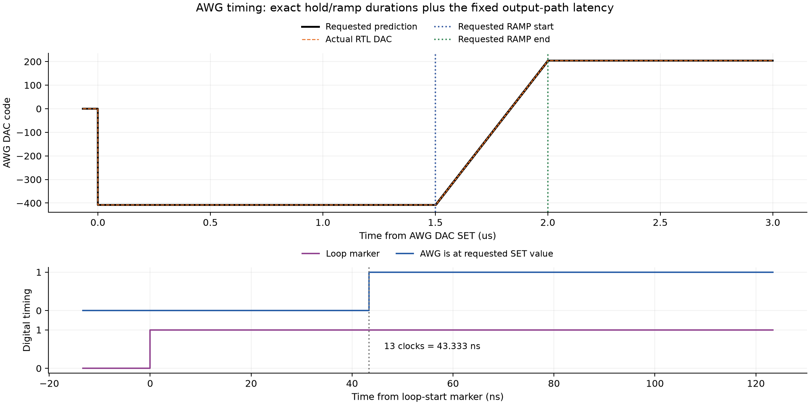

# AWG Tuning parameter sweep 및 hardware repeat RTL 검증

두 추가 시나리오 모두 **PASS**다. GUI exporter가 생성한 Python을 실제 QICK assembler로 컴파일하고, PMEM/DMEM에 로드한 뒤 실제 tProcessor RTL에서 실행했다. 각 point의 repeat는 같은 PMEM의 `FINE_TUNE_REP`로 되돌아가는 `loopnz`이며, 호스트가 같은 프로그램을 여러 번 실행한 것이 아니다.

| 시나리오 | Sweep points | Point당 repeat | 실제 shots | 입력 설정 기반 AWG 샘플 비교 | IQ64 샘플 | 결과 |
| --- | ---: | ---: | ---: | ---: | ---: | --- |
| `gui_awg_repeat` | 12 | 3 | 36 | 921,392 | 0 | PASS |
| `gui_awg_capture_repeat` | 2 | 2 | 4 | 1,124,432 | 32 | PASS |

## 설정과 검사

- `gui_awg_repeat`: AWG 시작 전압 −10 / 0 / +10 mV × SET hold 1.5 / 2.5 µs × RAMP duration 0.5 / 1.0 µs = 12 points. 각 point를 3회 반복하여 36 shots. RAMP의 끝 전압은 +5 mV, 마지막 SET hold는 1 µs다. 상승·하강 RAMP와 0 V SET을 모두 포함한다.
- `gui_awg_capture_repeat`: 시작 전압 −10 / +10 mV, 각 point 2회 반복하여 4 shots. 첫 hold 45 µs, RAMP 0.5 µs, 마지막 hold 9.5 µs. 190 MHz RF/readout과 trigger당 IQ64 8개 저장을 함께 실행했다.
- 두 경우 모두 SquarePulse는 40 kHz, 20 mV, phase 0°로 켜고 매 반복에서 같은 설정을 보낸다. 누적 위상 reset 없이 메인 AWG 반복 동안 출력이 연속되는지도 모든 샘플에서 검사했다.
- 각 loop의 시작·끝에서 0.37 µs marker를 보낸다. RF generator도 실제로 함께 실행한다. 빠른 36-shot 테스트는 DDR capture를 요청하지 않으며, 기존 디지털 입력 IP는 그대로 인스턴스화되어 있다.

검사는 두 층으로 수행했다. 먼저 QICK 명령 모델과 RTL의 명령값·dispatch 시점을 전부 비교했다. 그와 별개로 `check_awg_request.py`는 **사용자가 넣는 전압·시간·repeat 값만으로** sweep 순서, 명령 필드, 절대 예약 시각 및 매 DAC 샘플의 예상값을 계산한다. 이 두 번째 모델은 GUI compiler나 `AwgTuningBehaviorModel`을 호출하지 않는다. 실제로 받은 명령이 잘못된 경우를 놓치지 않도록, 수신 명령값을 정답으로 사용하지 않았다.

AWG DAC 출력은 매 300 MHz 클록의 **16개 lane 전체**를 검사했다. 같은 point의 반복 파형을 시작 시각에 맞춰 직접 비교한 결과도 완전히 같았다. Sweep axis가 끝난 뒤 다음 축으로 넘어갈 때의 값 복구, RAMP 계수 테이블 전환, point 내부 repeat, point 사이 전환을 모두 포함한다.

## 값과 타이밍

| 항목 | 확인된 값 |
| --- | --- |
| −10 / 0 / +10 mV의 SET 코드 | [-408, 0, 408] |
| +5 mV의 RAMP 끝 및 다음 SET 코드 | [204] |
| SET hold | [450, 750] clocks = 1.5 / 2.5 µs |
| RAMP 출력 길이 | [150, 300] clocks = 0.5 / 1.0 µs |
| RAMP 명령 발행 | 논리적 RAMP 시작보다 7 clocks 먼저, 내부 pipeline 지연 보상 |
| RAMP 다음 SET 명령 | RAMP 출력 구간 뒤 1-clock guard |
| 예약 시각 → AWG SET DAC 출력 | 1 dispatch + 3 routing + 10 output slice = 14 clocks, 46.666667 ns |
| Loop 시작 marker → AWG SET DAC 출력 | 13 clocks, 43.333333 ns |
| 36-shot 테스트 loop 간격 | 1491 clocks = 4.970000 µs |
| DDR 포함 테스트 loop 간격 | 16641 clocks = 55.470000 µs |
| 요청 설정 기반 예상 출력과 RTL 불일치 | 0 samples |

Hold와 RAMP duration은 DAC 경계에서 같은 고정 지연을 받은 파형을 기준으로 정확히 유지된다. RAMP 첫 scalar sample은 이전 SET 값과 같으므로, 실제 전압이 처음 바뀌는 sample이 segment 시작과 반드시 같지는 않다. 첫 변화 sample도 양자화 모델과 비교하여 일치함을 확인했다.

**Duration sweep에서 전체 loop 주기는 가장 긴 point에 맞춰 고정된다.** 36-shot 테스트에서 모든 loop 간격은 4.97 µs다. 짧은 hold/ramp point는 뒤쪽 +5 mV 유지 구간이 길어진다. GUI의 `max point duration + recovery + marker + SquarePulse lead` 동작이며, 각 hold/ramp 값이 무시되거나 point 전환이 늦어지는 것은 아니다.

Full scale은 800 mV다. 실제 아날로그 전압의 calibration을 측정한 것은 아니며, 이 설정을 DAC 코드로 변환한 값을 검증했다. 14-bit 유효 DAC의 최소 변화량은 16-bit word에서 **4 codes = 0.09765625 mV**다. 따라서 −10/+10 mV는 ±408 codes(±9.9609375 mV), +5 mV는 204 codes(4.98046875 mV)로 표현된다.

RAMP는 16비트 소수 정밀도의 정수 step과 정수 register-add sweep을 사용한다. 중간 amplitude point의 step은 각 point에서 새로 나눈 값과 최대 1 step-unit 차이가 있었다. 이상적인 연속 선형 ramp(양자화된 양 끝점 기준) 대비 최대 차이는 **4.037508 raw codes = 0.098572 mV**다. 이는 DAC 하위 2비트 제거와 step 반올림을 포함한다. 이 정수 규칙을 적용한 독립 예상 파형과 실제 RTL의 차이는 **0**이다.

## Trigger와 데이터 저장

36-shot 테스트의 외부 marker는 72개, DDR 포함 4-shot 테스트는 8개이며 모두 111 clocks = 0.37 µs다. 시작·끝 시각도 요청된 loop 일정과 정확히 일치했다.

DDR 포함 테스트는 4회 trigger 각각에 대해 8,712 clocks = 29.04 µs의 보정 deadline을 확인했다. 이후 첫 FIR valid부터 연속 8개씩 총 **32개 IQ64 sample**, **16개 256-bit AXI beat**가 저장되었다. 값, 순서, 주소, strobe가 전부 일치하며 반복 경계에서 샘플 누락·중복은 없었다.

## 비교 그래프

## 재현 및 파일

기존 RFDC/ARM 없는 시뮬레이션 프로젝트와 동일한 RTL snapshot을 재사용했다. 펌웨어 RTL이나 GUI 제품 코드를 수정하지 않았다. 새 입력은 `build_programs.py --case gui_awg_repeat`와 `--case gui_awg_capture_repeat`로 생성한다. 시뮬레이션은 각각 `run_xsim.py BUILD CASE --reuse --isolated-run`으로 실행하며, 완료 후 `analyze.py CASE`, `plot_awg_repeat.py`, `make_awg_report.py`를 실행한다.

각 폴더에 `gui_export.py`, `program.asm`, `pmem.hex`, `dmem.txt`, `expected.json`, `comparison.json`, `command_timing.csv`, **`awg_point_timing.csv`**를 보존했다. `awg_point_timing.csv`에는 40개 shot 각각의 전압·duration·repeat index·DAC 시작/끝·RAMP step·처음 변하는 sample을 기록했다. 추가 시나리오는 각각의 `gui_sources.json`에 실제 사용한 GUI 소스 hash를 기록했다.

아날로그 RFDC/보드 지연과 post-route timing은 이 RTL 검증의 범위 밖이다. 전체 프로젝트 구성과 기존 SquarePulse 검증은 [RESULTS.md](RESULTS.md)를 참고한다.
