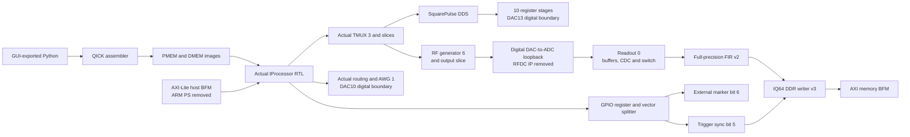

# GUI-to-tProcessor RTL integration simulation

This is a separate, simulation-only project based on the published HWH and Tcl
in `../qstl_awg_tuning_fir_1msps_iq64_sq_pulse`. It does not modify production
RTL, the production Vivado project, BIT, HWH or XSA.

The actual GUI exporter generates `gui_*/gui_export.py`. Its `build_program()`
uses the real QICK register manager and assembler. `program.asm`, `pmem.hex`
and `dmem.txt` are the resulting assembly, machine instructions and runtime
sweep tables. The testbench loads PMEM through a synchronous memory model and
loads DMEM through the actual tProcessor AXI-Lite slave. Commands are executed
by the real `axis_tproc64x32_x8` RTL, not injected into the generator ports.

## Retained hardware and boundaries

- All 78 selected production digital IP cells and 87 internal AXIS nets:
  tProcessor, TMUXes, command/output register slices, four RF generators,
  seven AWG generators, one SquarePulse generator, GPIO register/vector split,
  four dynamic readouts, average/trace buffers, CDCs, routing switches,
  full-precision 300:1 FIR, trigger synchronizer and IQ64 DDR writer.
- Production parameters and clock domains: 300 MHz fabric/tProcessor,
  99.999985 MHz AXI host and 333.25 MHz DDR AXI.
- Replaced boundaries: PS and its AXI interconnect (direct AXI-Lite BFM),
  host DMA (idle AXIS sources/ready sinks), PMEM BRAM (one-cycle synchronous
  64-bit ROM), RFDC (packed digital ADC source/DAC sink), and external DDR
  controller/PHY (ordered AXI write sink). Host addresses are slave-relative.
- ADC stimulus: digital loopback of the actual 190 MHz RF DAC stream to ADC0,
  selecting samples 0,2,...,14 from each 16-sample DAC word (4.8 to 2.4 GSPS)
  with one fabric register of boundary latency and unit digital gain. Readout
  frequency is also 190 MHz. This boundary is an ideal digital loopback, not
  an analog RFDC model. Other ADC ports are idle. An optional `ADC_CW=1`
  plusarg selects a deterministic independent 190 MHz carrier instead.
- DDR BFM is a transaction sink, not a DDR electrical/timing model. Analog
  RFDC latency, board propagation, analog output calibration and post-route
  setup/hold timing are outside this RTL simulation.

`topology_audit.json` compares all retained interfaces and shared HWH
parameters. The only permitted differences are peripheral address windows
relocated by removal of the PS AXI interconnect.

The exercised paths are shown below. The other production digital channels
are also instantiated; the diagram groups their routing to stay readable.

## Scenarios

| Export | SquarePulse | Other main-program activity | Marker |
| --- | --- | --- | --- |
| `gui_sweep` | Cartesian hardware sweep: 40/80 kHz, 20/40 mV at 800 mV full scale, 0/90 degrees | AWG SET/RAMP/SET, 190 MHz RF pulse on the same TMUX as SquarePulse, eight IQ64 samples per shot | Each loop start and end, 0.37 us |
| `gui_500us` | Fixed 2 kHz, 20/40 mV hardware sweep, fixed 270 degrees; 325 us first hold in each of two loops. A full 500 us period crosses the amplitude update. | Same RF/readout/AWG activity | Experiment start and end, 0.37 us |
| `gui_autonomy` | A diagnostic seed program enables a 2 kHz square and reaches END. After 100 us, an unmodified GUI export with SquarePulse disabled runs without resetting any IP. | AWG/RF/DDR/markers continue while DDS phase accumulates independently | Experiment start and end, 0.37 us |
| `gui_frequency` | Frequency-only 40/80 kHz hardware sweep, constant 20 mV amplitude and zero phase offset | Same RF/readout/AWG activity | Each loop start and end, 0.37 us |
| `gui_awg_repeat` | Fixed 40 kHz, 20 mV, phase zero; re-issued without reset each loop | AWG -10/0/+10 mV x 1.5/2.5 us SET hold x 0.5/1 us RAMP, three hardware repeats per point (36 shots); +5 mV tail; 190 MHz, 0.5 us RF pulses; no DDR capture request | Each loop start and end, 0.37 us |
| `gui_awg_capture_repeat` | Same fixed SquarePulse | AWG -10/+10 mV, two hardware repeats per point (4 shots); 45 us hold, 0.5 us RAMP and 9.5 us tail; RF/readout and eight IQ64 samples per shot | Each loop start and end, 0.37 us |

These are explicitly selected test configurations passed through the same
exporter as the GUI; they are not a claim to recover a live GUI window's state.
`gui_sources.json` records the latest compilation's exporter source hashes.
The additional AWG/repeat scenarios also save their own `gui_sources.json`
so later GUI revisions can be distinguished. Exact exports and compiled memory
images are retained separately for every completed scenario.
`soccfg.json` is the compiler's view of the production firmware. Its `rf`
section records connected converter channels and their source-HWH clocks for
GUI/QICK discovery; it does not instantiate an RFDC in the simulation DUT.

The ordinary GUI export explicitly sends a final SquarePulse mute command.
That programmed epilogue is distinct from the DDS reacting to tProcessor END.
The autonomy scenario tests END and restart without sending a mute command.

## Checks

1. Compare every actual tProcessor command word and dispatch time with the
   QICK instruction-level model executing the same program and DMEM tables.
   The dispatcher detects the deadline in WAIT_ST, then transfers on the next
   clock; this architectural one-clock offset is checked, not fitted.
2. Verify command words and fixed routing latency at the SquarePulse, AWG and
   RF inputs. RF and SquarePulse share a real TMUX.
3. At every 300 MHz clock, compare all sixteen SquarePulse lanes against an
   independent **scalar** phase-integral reference. The reference advances
   phase once per sample; it does not reproduce the RTL's parallel adder tree.
   Check the additional ten production DAC output-register cycles separately.
4. Check external marker count/width and DDR trigger queue maturation at
   precisely 8,712 fabric clocks after trigger acceptance. The next valid
   1 MSPS sample can follow the deadline by a decimation-phase-dependent delay.
5. Compare captured FIR IQ words with every packed 256-bit DDR AXI beat,
   including addresses, strobes and sample/trigger counts.
6. Compare AWG SET/RAMP/SET output with its independent behavioral model.
   Measure RF pulse length, peak code and carrier frequency from the actual
   RF DAC words used by the ADC loopback. Check the requested SquarePulse
   Cartesian points independently of the assembler model.
7. For the AWG/repeat cases, also derive a full scalar waveform directly from
   the requested voltage/time/repetition dictionary. `check_awg_request.py`
   imports neither the GUI compiler nor the AWG behavioral model and does not
   use received command fields as its expected values. Check each SET code,
   RAMP target/duration/step, Cartesian order, absolute scheduled timestamp,
   DAC sample, start/end marker, and equality of repeated waveforms.
   Quantized affine step updates are checked exactly; their small difference
   from an ideal continuous line is reported separately.

The first four scenarios use one repetition per point. The two additional
cases exercise the taken `FINE_TUNE_REP` back-edge with three and two repeats.
Duration sweeps have a fixed loop interval based on the longest point: shorter
points hold their final voltage longer. RAMP startup is hidden by issuing its
command seven clocks before the logical boundary. The following SET has a
one-clock guard. See `AWG_SWEEP_RESULTS.md` for measured values and plots.

CSV traces contain cycle timestamps. A cycle represents 1/300 us in the main
clock domain. Sample comparison runs every cycle; CSV waveform output is
compressed only by omitting unchanged values (with periodic checkpoints).

## Reproduction

Requirements: Vivado/XSim 2023.1, Python with NumPy/Matplotlib, QSTL_QICK's local
`qick/qick_lib` on PYTHONPATH, and the QICK GUI checkout with its Python dependencies. Hardware/PYNQ is not
required. `QickSim` is used only to discover configuration from HWH using the
real drivers; it is not the RTL device under test.

From the QSTL_QICK root, with this directory as `SIM` and a fresh external
output directory as `BUILD`:

1. `python SIM/build_design.py`
2. `python SIM/build_programs.py --gui PATH_TO_PulseGenerator-qick`
3. `vivado -mode batch -source SIM/proj.tcl -tclargs BUILD`
4. `python SIM/audit_topology.py BUILD`
5. `python SIM/build_tb.py BUILD`
6. `vivado -mode batch -source SIM/simulate.tcl -tclargs BUILD gui_sweep 136512 8`
   This exports simulator scripts and vendor model dependencies only.
7. `python SIM/prepare_xsim.py BUILD`
8. `python SIM/run_xsim.py BUILD gui_sweep`
9. `python SIM/run_xsim.py BUILD gui_500us --reuse`
10. `python SIM/run_xsim.py BUILD gui_autonomy --reuse`
11. `python SIM/run_xsim.py BUILD gui_frequency --reuse`
12. `python SIM/run_xsim.py BUILD gui_awg_repeat --reuse`
13. `python SIM/run_xsim.py BUILD gui_awg_capture_repeat --reuse`
14. Run `analyze.py CASE` for all six cases, and `plot_results.py CASE` for the four original cases and `gui_awg_capture_repeat`.
15. Run `plot_independent_updates.py`, `plot_long_runs.py`, `plot_awg_repeat.py`, `make_awg_report.py`, then `make_report.py` after all cases pass.

With an existing snapshot, `--reuse --isolated-run` gives each scenario its own
simulator directory so independent scenarios can run concurrently. The DUT is
unchanged. This is useful because simulation of all retained vendor primitives
is slow. `--case CASE` on `build_programs.py` regenerates only one input program.

After generating the native simulation sources, `install_sim_sources.tcl`
registers those same copies in the Vivado project's simulation fileset:
`vivado -mode batch -source SIM/install_sim_sources.tcl -tclargs BUILD gui_sweep 136512 8`.
The `.xpr` then has `tb_gui` as its simulation top and the scenario plusargs
in `BUILD/gui_plusargs.txt`; its initial simulation runtime is 0 ns (Run All
executes the test). The production-shaped block diagram remains visible as
the design source. Run this registration last, after `prepare_xsim.py`.

Legacy QICK IPs reuse internal HDL unit names (`fifo`, `bram_dp`,
`dds_compiler_0`) across packages. Their OOC synthesis is isolated but a flat
mixed-language simulator is not. Also, `axis_avg_buffer` omits synthesis HDL
from its simulation file set, and `qick_vec2bit` lacks a simulation model name.
`prepare_xsim.py` copies the actual synthesis HDL sources, scopes HDL unit
identifiers by IP family, and binds the vector splitter wrapper to its real
top. No datapath or state-machine logic is substituted. All source hashes,
identifier maps and copied hashes are recorded in `namespace_manifest.json`.
Generated HDL and XSim binaries reside in BUILD, outside the source repository.

## Complex screenshot waveform, 10 x 10 sweep

`COMPLEX_SWEEP_RESULTS.md` records a further two-channel screenshot-derived
test with 50 ns and 100 ns ramps. The real GUI export runs 100 nested hardware
sweep points on the retained production tProcessor/TMUX/AWG/marker RTL. A
36,000-cycle prefix of the same program also runs on the original 78-IP DUT;
its samples, command events and GPIO match the focused DUT exactly.

This case **does not pass all requested-value/timing checks**: constant integer
voltage increments accumulate error, independently swept ramp steps can
overshoot, and 99 loop-start markers are two clocks late. The report preserves
the failures and their plots. Production RTL and GUI code were not changed by
this diagnostic test. Use `build_complex_program.py`, `build_complex_tb.py`,
`run_complex_xsim.py`, `analyze_complex.py`, and `plot_complex.py` as described
in that report. The analyzer deliberately returns nonzero for these failures.
